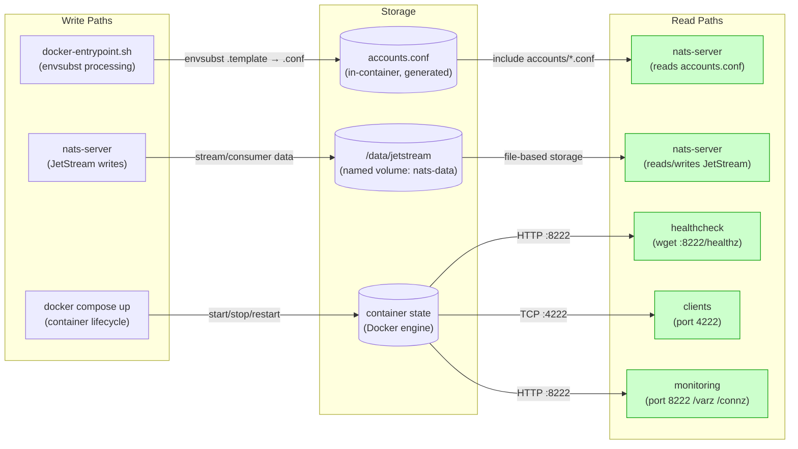
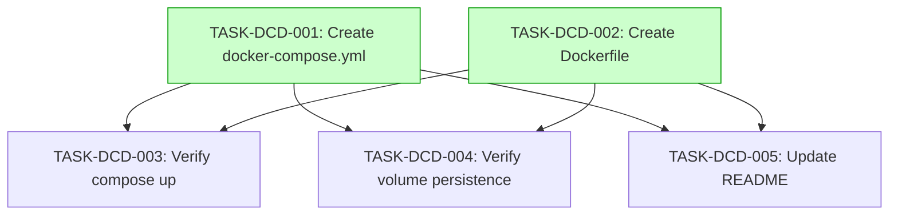

/feature-plan "Docker Compose Deployment: NATS server with JetStream, volume persistence, health checks" \
  --context docs/design/specs/nats-infrastructure-system-spec.md
━━━━━━━━━━━━━━━━━━━━━━━━━━━━━━━━━━━━━━━━━━━━
FEATURE PLANNING: Docker Compose Deployment: NATS server with JetStream, volume persistence, health checks
━━━━━━━━━━━━━━━━━━━━━━━━━━━━━━━━━━━━━━━━━━━━

Step 1: Loading context and preparing clarification...

Let me start by reading the context file and launching the review scope clarification in parallel.

Read nats-infrastructure-system-spec.md
Read MEMORY.md
Context file loaded. This feature maps to Feature 4: Docker Compose Deployment from the system spec (covering NATS server, JetStream volumes, health checks, and restart policies).

Step 2: Review Scope Clarification (Context A)

Agent:Review scope clarification
IN
Execute clarification for feature planning.

CONTEXT TYPE: review_scope

FEATURE: "Docker Compose Deployment: NATS server with JetStream, volume persistence, health checks"

This is an infrastructure/DevOps feature — creating docker-compose.yml with NATS server configuration, JetStream volume persistence, health checks, and environment variable management. The target deployment is a Dell DGX Spark GB10 running Ubuntu 24.04, accessible via Tailscale mesh VPN.

ESTIMATED COMPLEXITY: 5/10

FLAGS:
  --no-questions: false
  --with-questions: false
  --defaults: false
  --answers: none

Ask the user about:
1. Review focus (all/technical/architecture/performance/security)
2. Trade-off priority (speed/quality/cost/maintainability/balanced)
3. Any specific concerns to address

Present the questions clearly with options and defaults, then wait for the user's response. Return ClarificationContext with review preferences.
Read core.py
━━━━━━━━━━━━━━━━━━━━━━━━━━━━━━━━━━━━━━━
REVIEW SCOPE CLARIFICATION
━━━━━━━━━━━━━━━━━━━━━━━━━━━━━━━━━━━━━━━

Q1. Review Focus — Which aspect should the review prioritise?

Option	Description
[A]	All areas — comprehensive review across all dimensions
[B]	Technical — implementation correctness, YAML syntax, Docker specifics
[C]	Architecture — service topology, dependency ordering, networking design
[D]	Performance — resource limits, JetStream tuning, reconnect behaviour
[E]	Security — secret/credential handling, network exposure, Tailscale surface
Default: [A] All areas

Q2. Trade-off Priority — When competing options arise, what should guide recommendations?

Option	Description
[S]	Speed — ship quickly, favour simplicity
[Q]	Quality — correctness and robustness first
[C]	Cost — minimise resource usage on GB10
[M]	Maintainability — easy to operate and evolve
[B]	Balanced — weigh all factors equally
Default: [M] Maintainability

Q3. Specific Concerns — Any particular concerns for the review to address?

Examples: volume bind-mount paths on Ubuntu 24.04, health check timing for slow JetStream init, Tailscale port exposure, credential management without Docker secrets

Default: none (Enter to skip)

Please provide your answers (e.g., A, M, none or just press Enter for all defaults).

buildplan.md
accept defaults
━━━━━━━━━━━━━━━━━━━━━━━━━━━━━━━━━━━━━━━
Context A recorded: Focus=All areas, Priority=Maintainability, Concerns=none
━━━━━━━━━━━━━━━━━━━━━━━━━━━━━━━━━━━━━━━

Step 2.5: Checking Graphiti context...

Bash Check if tasks directory exists
IN
ls /Users/richardwoollcott/Projects/appmilla_github/nats-infrastructure/tasks/ 2>/dev/null || echo "NO_TASKS_DIR"

OUT
backlog
blocked
completed
design_approved
in_progress
in_review
Bash Check if .guardkit directory exists
IN
ls /Users/richardwoollcott/Projects/appmilla_github/nats-infrastructure/.guardkit/ 2>/dev/null || echo "NO_GUARDKIT_DIR"

OUT
autobuild
features
graphiti-query-log.jsonl
graphiti.yaml
seeding
worktrees
Graphiti MCP is available. Let me query for relevant context and proceed with task creation in parallel.

Graphiti [search_nodes]Docker Compose NATS JetStream deployment…
OUT
{"result":{"message":"Nodes retrieved successfully","nodes":[{"uuid":"d4489c02-361b-40a3-a0d1-896544414424","name":"readiness gate logic","labels":["Entity","Topic"],"created_at":"2026-04-07T09:42:45.074201+00:00","summary":"Readiness gate logic in Clarification Engine checks >=80% completeness and requires user confirmation.","group_id":"architecture_decisions","attributes":{}},{"uuid":"31787a55-afc4-4057-9c88-59759964cf6d","name":".guardkit/worktrees/FEAT-XXX/","labels":["Entity"],"created_at":"2026-03-04T17:44:50.887518+00:00","summary":".guardkit/worktrees/FEAT-XXX/ is the shared worktree directory for feature-mode tasks in guardkit; paths must use FEAT-XXX ID, not TASK-XXX, to avoid FileNotFoundError and ensure correct artifact placement in .guardkit/worktrees/FEAT-XXX/.guardkit/autobuild/TASK-XXX/ (ADR-FB-002). This decision was updated on 2026-04-11 for the specialist-agent project.","group_id":"architecture_decisions","attributes":{}},{"uuid":"c176936e-2b9a-456f-a7ce-7b012739dec9","name":".guardkit/worktrees/FEAT-XXX/.guardkit/autobuild/TASK-XXX/","labels":["Entity"],"created_at":"2026-03-04T17:44:50.887530+00:00","summary":"In feature mode, .guardkit/worktrees/FEAT-XXX/.guardkit/autobuild/TASK-XXX/ stores task artifacts; FEAT-XXX identifies the shared worktree, TASK-XXX identifies per-task subdirectories. Using TASK-XXX for worktree paths causes FileNotFoundError.","group_id":"architecture_decisions","attributes":{}},{"uuid":"2b7e0dd8-4729-447e-960b-81ec960e74d8","name":"Orchestrator + Core API + CLI + first run","labels":["Entity","Object"],"created_at":"2026-04-07T09:36:04.349473+00:00","summary":"Depends on FEAT-001-004, High complexity, Day 2 (9 Apr) afternoon.","group_id":"architecture_decisions","attributes":{}},{"uuid":"1316963d-f08c-4250-ac6a-bcc2450abacc","name":"Claude Agents SDK","labels":["Entity"],"created_at":"2026-03-04T17:44:06.591773+00:00","summary":"Claude Agents SDK’s query() function invokes /task-work --implement-only and --design-only slash commands directly for quality gate execution in feature-build workflow, avoiding CalledProcessError from subprocess calls to non-existent guardkit CLI commands (ADR-FB-001).","group_id":"architecture_decisions","attributes":{}}]}}
Graphiti [search_memory_facts]Docker Compose NATS JetStream deployment…
OUT
{"result":{"message":"Facts retrieved successfully","facts":[{"uuid":"d2236320-b24b-4c1b-b71e-79af0a683ce5","group_id":"guardkit__task_outcomes","source_node_uuid":"4e9cc1fc-9edb-4438-9d28-917c937da38d","target_node_uuid":"6f70920a-168a-42d0-91fe-14488cd09e00","created_at":"2026-04-03T21:53:34.326972Z","name":"HAS_VERSION_CONSTRAINTS_SOURCE","fact":"nats-asyncio-service uses version constraints sourced from the pyproject.toml.template file.","episodes":["5a05ea71-6a9e-4e73-b2fe-c120266ee6ea"],"expired_at":"2026-04-03T22:03:59.152077Z","valid_at":"2026-04-03T21:52:31.815168Z","invalid_at":"2026-04-03T22:03:12Z","attributes":{}},{"uuid":"cffdadf4-6428-4f42-abed-8a625c1438a9","group_id":"guardkit__task_outcomes","source_node_uuid":"4e9cc1fc-9edb-4438-9d28-917c937da38d","target_node_uuid":"b5bb83eb-04e9-4adc-813c-99c5af8fc156","created_at":"2026-04-03T21:59:10.920063Z","name":"EXTENDED_CODE_STYLE","fact":"nats-asyncio-service's settings.json had its code_style extended with six missing fields, making the file follow Python conventions.","episodes":["d1353c1d-42d6-4c65-95bc-f5d05a777743"],"expired_at":"2026-04-03T22:03:59.152083Z","valid_at":"2026-04-03T21:58:39.974000Z","invalid_at":"2026-04-03T22:03:12Z","attributes":{}},{"uuid":"e0a1c780-fea7-4671-ba00-b1ebc15abf9b","group_id":"guardkit__task_outcomes","source_node_uuid":"fb223040-6ee4-4cc3-bfbc-ebe131849967","target_node_uuid":"bbd86ccd-8afa-41d2-859f-3f5633b69d90","created_at":"2026-04-10T12:18:44.100523Z","name":"UPDATED_WITH","fact":"API-nats-subjects.md was updated to use fleet-standard agents.*/fleet.* patterns from the nats-core Topics registry.","episodes":["ea1a2460-8c1f-4f22-9174-8959659af798"],"expired_at":null,"valid_at":"2026-04-10T12:17:25.489872Z","invalid_at":null,"attributes":{}},{"uuid":"ab4ebd23-0863-4e6b-9cf2-e5a05662f6dc","group_id":"guardkit__task_outcomes","source_node_uuid":"4e9cc1fc-9edb-4438-9d28-917c937da38d","target_node_uuid":"6f70920a-168a-42d0-91fe-14488cd09e00","created_at":"2026-04-03T21:53:34.326914Z","name":"HAS_MANIFEST_SETTINGS_ENRICHMENT","fact":"nats-asyncio-service manifest and settings were enriched based on the framework version constraints from the pyproject.toml.template file.","episodes":["5a05ea71-6a9e-4e73-b2fe-c120266ee6ea"],"expired_at":"2026-04-03T22:03:59.152080Z","valid_at":"2026-04-03T21:52:31.815168Z","invalid_at":"2026-04-03T22:03:12Z","attributes":{}},{"uuid":"41fc5b24-46a6-4ed4-881a-5e728bf32d91","group_id":"guardkit__task_outcomes","source_node_uuid":"fb223040-6ee4-4cc3-bfbc-ebe131849967","target_node_uuid":"4a41c4e6-85a8-4031-a979-a30c8b6c4c09","created_at":"2026-04-10T12:18:44.100596Z","name":"REFER_TO","fact":"The document API-nats-subjects.md refers to TASK-9E6F (RC-5) to address remaining D1 NATS subject convention conflicts.","episodes":["ea1a2460-8c1f-4f22-9174-8959659af798"],"expired_at":null,"valid_at":"2026-04-10T12:17:25.489872Z","invalid_at":null,"attributes":{}},{"uuid":"6df1734c-561d-405b-a3a4-c48b3c118acf","group_id":"guardkit__project_decisions","source_node_uuid":"b43cfd6d-be64-4fc7-be6c-2a8a12f3b1e9","target_node_uuid":"5aa10002-ea15-46e6-a444-b3c51b302e9a","created_at":"2026-04-10T12:40:44.672471Z","name":"REQUIRES_CONCRETE_TYPE","fact":"NatsEventPublisher requires NatsConnection for JetStream operations.","episodes":["415c7079-13a7-4fe7-9501-d86f59970c33"],"expired_at":null,"valid_at":"2026-04-10T12:39:19Z","invalid_at":null,"attributes":{}},{"uuid":"75d56a7b-8e15-4283-ae4b-1e574687f04e","group_id":"guardkit__project_decisions","source_node_uuid":"1ed05c88-69a3-49ff-a4b2-6519094dd6a2","target_node_uuid":"70236794-6a98-45ab-83df-719193316058","created_at":"2026-04-10T12:40:44.672582Z","name":"CONTEXT_OF_TASK","fact":"TASK-W7 is the context for the NATS Fleet Integration for dotnet-functional-fastendpoints-exemplar project.","episodes":["415c7079-13a7-4fe7-9501-d86f59970c33"],"expired_at":null,"valid_at":"2026-04-10T12:39:19Z","invalid_at":null,"attributes":{}},{"uuid":"17be4589-eb97-470f-b461-349969cf1fa6","group_id":"guardkit__project_decisions","source_node_uuid":"1ed05c88-69a3-49ff-a4b2-6519094dd6a2","target_node_uuid":"f211dc0e-b6c0-4bc5-be85-338d71af04ce","created_at":"2026-04-10T11:02:31.621397Z","name":"CONTEXT_OF","fact":"Context: TASK-W5 (Database + Docker scaffold for dotnet-fastendpoints-exemplar) involves Migration SQL files.","episodes":["ef456032-e9ff-42d2-b4e6-bc5a2ec383cc"],"expired_at":null,"valid_at":"2026-04-10T11:00:25.759290Z","invalid_at":null,"attributes":{}},{"uuid":"adf2bad1-cb71-475b-8f3e-76c7c40676eb","group_id":"guardkit__project_decisions","source_node_uuid":"3a30491f-4b05-44cf-85a7-025eeb5cfa4e","target_node_uuid":"9826cae1-2420-4392-a718-4416ba5baf8e","created_at":"2026-04-10T12:40:44.672601Z","name":"CONSTRUCTION_NOT_ALLOWED_IN_INTERFACE","fact":"Construction of NatsJSContext is not allowed within the INatsConnection interface in NATS.Net 2.x.","episodes":["415c7079-13a7-4fe7-9501-d86f59970c33"],"expired_at":null,"valid_at":"2026-04-10T12:39:19Z","invalid_at":null,"attributes":{}},{"uuid":"c6558a94-b6cb-41aa-8d7f-2af2fbd46468","group_id":"guardkit__project_decisions","source_node_uuid":"ff58c7c8-eb98-4f29-99ac-e802d456af7b","target_node_uuid":"f211dc0e-b6c0-4bc5-be85-338d71af04ce","created_at":"2026-04-10T11:02:31.621286Z","name":"DISCOVERS_WITH","fact":"DbUp discovers Migration SQL files via WithScriptsEmbeddedInAssembly method filtered by script.Contains('.Migrations.')","episodes":["ef456032-e9ff-42d2-b4e6-bc5a2ec383cc"],"expired_at":null,"valid_at":"2026-04-10T11:00:25.759290Z","invalid_at":null,"attributes":{}},{"uuid":"8cdd1d3e-138f-4538-924a-134916c6606e","group_id":"architecture_decisions","source_node_uuid":"6d6e34e4-29f5-4213-adf7-4c6dfd7f87b4","target_node_uuid":"956d0417-240b-4c3a-ba53-9c8036019e3b","created_at":"2026-04-07T09:47:27.252895Z","name":"HAS_SUBTASK","fact":"The criteria loader is part of the Session types.","episodes":["669c4567-f620-4385-a36e-958178d48b00"],"expired_at":null,"valid_at":"2026-04-07T09:41:50.580062Z","invalid_at":null,"attributes":{}},{"uuid":"3d339787-0394-41fc-851f-64ea621c92cf","group_id":"architecture_decisions","source_node_uuid":"31787a55-afc4-4057-9c88-59759964cf6d","target_node_uuid":"c176936e-2b9a-456f-a7ce-7b012739dec9","created_at":"2026-04-11T16:38:38.737366Z","name":"CONTAINS_PATH","fact":".guardkit/worktrees/FEAT-XXX/ contains .guardkit/worktrees/FEAT-XXX/.guardkit/autobuild/TASK-XXX/","episodes":["9a376cd7-46b9-4438-89a2-76b727625d10"],"expired_at":null,"valid_at":"2026-04-11T16:37:23.800990Z","invalid_at":null,"attributes":{}},{"uuid":"023ba79e-cfcb-4efd-ab16-1fd7501417dc","group_id":"architecture_decisions","source_node_uuid":"c49ba3a8-85af-44f5-9628-b78a8cfb41f6","target_node_uuid":"2b7e0dd8-4729-447e-960b-81ec960e74d8","created_at":"2026-04-07T09:41:24.344393Z","name":"DEPENDENCY","fact":"Orchestrator + Core API + CLI + first run depends on Doc reader + Player-Coach factories","episodes":["65f18e38-97ce-402c-b78a-3a12742c14ca"],"expired_at":null,"valid_at":"2026-04-07T00:00:00Z","invalid_at":null,"attributes":{}},{"uuid":"05aa44c9-c662-403a-b5ba-f8f549ebaf72","group_id":"architecture_decisions","source_node_uuid":"67394116-dd52-4a42-8604-f9d252a2c879","target_node_uuid":"de5e88d6-2887-4145-8579-0784e9ad1289","created_at":"2026-04-07T09:41:24.344476Z","name":"DEPENDENCY","fact":"FEAT-001: Foundation (types, LLM client, criteria) is part of the module layout under orchestrator/","episodes":["65f18e38-97ce-402c-b78a-3a12742c14ca"],"expired_at":null,"valid_at":"2026-04-07T09:35:15.847167Z","invalid_at":null,"attributes":{}},{"uuid":"471cf738-40e9-41a4-9d5e-3e711f89f396","group_id":"architecture_decisions","source_node_uuid":"de5e88d6-2887-4145-8579-0784e9ad1289","target_node_uuid":"67394116-dd52-4a42-8604-f9d252a2c879","created_at":"2026-04-07T09:41:24.344516Z","name":"DEPENDENCY","fact":"The module layout under orchestrator/ depends on FEAT-001: Foundation (types, LLM client, criteria).","episodes":["65f18e38-97ce-402c-b78a-3a12742c14ca"],"expired_at":null,"valid_at":"2026-04-07T09:35:15.847167Z","invalid_at":null,"attributes":{}}]}}
[Graphiti] Feature context loaded: 3 relevant items

Similar features: 0
Architecture context: 2 (NATS subject conventions, NatsConnection for JetStream)
Past outcomes: 1 (fleet-standard agents/fleet patterns)
Step 3: Creating review task...

Update Todos

Context A: Review scope clarification

Graphiti pre-planning context loading

Create review task via /task-create

Execute /task-review with decision analysis

Present decision checkpoint

Handle user decision and generate implementation structure
task-create skill
Let me create the review task file.

Bash List existing backlog tasks
IN
ls /Users/richardwoollcott/Projects/appmilla_github/nats-infrastructure/tasks/backlog/ 2>/dev/null

OUT
nats-server-config
TASK-NATS-003-create-env-example.md
TASK-REV-69BD-plan-nats-server-configuration.md
Bash Generate unique task ID hash
IN
python3 -c "import hashlib, time, os; h = hashlib.sha256(f'{time.time()}{os.getpid()}docker-compose-deployment'.encode()).hexdigest()[:4].upper(); print(h)"

OUT
1A6B
Write TASK-REV-1A6B-plan-docker-compose-deployment.md
51 lines
---
id: TASK-REV-1A6B
title: "Plan: Docker Compose Deployment - NATS server with JetStream, volume persistence, health checks"
status: backlog
created: 2026-04-13T00:00:00Z
updated: 2026-04-13T00:00:00Z
priority: high
tags: [docker, nats, jetstream, infrastructure, deployment]
task_type: review
complexity: 5
test_results:
  status: pending
  coverage: null
  last_run: null
---

# Task: Plan Docker Compose Deployment

## Description

Plan the Docker Compose deployment for the NATS server with JetStream enabled, including volume persistence for JetStream data, health checks via the monitoring endpoint, and environment variable management. This is Feature 4 from the nats-infrastructure system specification.

Target deployment: Dell DGX Spark GB10 (Ubuntu 24.04), accessible via Tailscale mesh VPN.

## Context

- System spec: docs/design/specs/nats-infrastructure-system-spec.md (Feature 4)
- NATS server config: config/nats-server.conf (JetStream store_dir: /data/jetstream)
- Monitoring endpoint: port 8222
- Client connections: port 4222
- Volume: nats-data for JetStream persistence

## Review Focus

- All aspects (comprehensive review)
- Trade-off priority: Maintainability
- No specific concerns flagged

## Acceptance Criteria

- [ ] Technical options analysed for Docker Compose configuration
- [ ] Architecture implications reviewed (volume mounts, networking, restart policy)
- [ ] Effort estimation and complexity assessment completed
- [ ] Risk analysis and potential blockers identified
- [ ] Recommended approach with justification provided
- [ ] Implementation task breakdown created

## Implementation Notes

[Space for review findings and decision]
Update Todos

Context A: Review scope clarification

Graphiti pre-planning context loading

Create review task via /task-create

Execute /task-review with decision analysis

Present decision checkpoint

Handle user decision and generate implementation structure
Step 3: Review task created.


✅ Task created: TASK-REV-1A6B
📋 Title: Plan: Docker Compose Deployment - NATS server with JetStream, volume persistence, health checks
📁 Location: tasks/backlog/TASK-REV-1A6B-plan-docker-compose-deployment.md
Step 4: Executing decision review...

task-review skill
Let me analyze the current state of the codebase to inform the review.

Bash List repo root structure
IN
ls -la /Users/richardwoollcott/Projects/appmilla_github/nats-infrastructure/

OUT
total 56
drwxr-xr-x   18 richardwoollcott  staff   576 Apr  8 10:30 .
drwxr-xr-x  158 richardwoollcott  staff  5056 Apr 13 14:17 ..
drwxr-xr-x@   8 richardwoollcott  staff   256 Apr  3 23:39 .claude
-rw-r--r--@   1 richardwoollcott  staff  1896 Apr  8 10:30 .env.example
drwxr-xr-x   16 richardwoollcott  staff   512 Apr 12 13:16 .git
-rw-r--r--    1 richardwoollcott  staff  4688 Apr  1 08:03 .gitignore
drwxr-xr-x@   8 richardwoollcott  staff   256 Apr  8 09:40 .guardkit
-rw-r--r--@   1 richardwoollcott  staff     0 Apr  8 10:30 .guardkit-git.lock
-rw-r--r--    1 richardwoollcott  staff   891 Apr 12 09:28 .mcp.json
-rw-r--r--    1 richardwoollcott  staff  3973 Apr  8 09:39 command-history.md
drwxr-xr-x@   4 richardwoollcott  staff   128 Apr  8 10:30 config
drwxr-xr-x    6 richardwoollcott  staff   192 Apr 13 18:28 docs
-rw-r--r--    1 richardwoollcott  staff  1065 Apr  1 08:03 LICENSE
drwxr-xr-x@   2 richardwoollcott  staff    64 Apr  4 13:27 migrations
-rw-r--r--@   1 richardwoollcott  staff  1964 Apr  8 10:30 README.md
drwxr-xr-x@   4 richardwoollcott  staff   128 Apr  8 10:30 scripts
drwxr-xr-x@   8 richardwoollcott  staff   256 Apr  8 10:30 tasks
drwxr-xr-x@   6 richardwoollcott  staff   192 Apr  8 10:30 tests
Bash Check config directory
IN
ls -la /Users/richardwoollcott/Projects/appmilla_github/nats-infrastructure/config/ 2>/dev/null || echo "NO_CONFIG_DIR"

OUT
total 8
drwxr-xr-x@  4 richardwoollcott  staff   128 Apr  8 10:30 .
drwxr-xr-x  18 richardwoollcott  staff   576 Apr  8 10:30 ..
drwxr-xr-x@  3 richardwoollcott  staff    96 Apr  8 10:30 accounts
-rw-r--r--@  1 richardwoollcott  staff  2409 Apr  8 10:30 nats-server.conf
Globpattern: "**/docker-compose*.yml"
No files found
Read nats-server.conf
Read .env.example
Read README.md
Bash List scripts directory
IN
ls -la /Users/richardwoollcott/Projects/appmilla_github/nats-infrastructure/scripts/

OUT
total 32
drwxr-xr-x@  4 richardwoollcott  staff   128 Apr  8 10:30 .
drwxr-xr-x  18 richardwoollcott  staff   576 Apr  8 10:30 ..
-rwxr-xr-x@  1 richardwoollcott  staff  2823 Apr  8 10:30 docker-entrypoint.sh
-rwxr-xr-x@  1 richardwoollcott  staff  8725 Apr  8 10:30 verify-nats.sh
Bash List accounts config directory
IN
ls -la /Users/richardwoollcott/Projects/appmilla_github/nats-infrastructure/config/accounts/

OUT
total 8
drwxr-xr-x@ 3 richardwoollcott  staff    96 Apr  8 10:30 .
drwxr-xr-x@ 4 richardwoollcott  staff   128 Apr  8 10:30 ..
-rw-r--r--@ 1 richardwoollcott  staff  3288 Apr  8 10:30 accounts.conf.template
Read docker-entrypoint.sh
Read accounts.conf.template
Now I have a complete picture of the codebase. Let me present the review analysis.

━━━━━━━━━━━━━━━━━━━━━━━━━━━━━━━━━━━━━━━━━━━━
TECHNICAL OPTIONS ANALYSIS: Docker Compose Deployment
━━━━━━━━━━━━━━━━━━━━━━━━━━━━━━━━━━━━━━━━━━━━

Review Mode: decision | Depth: standard | Focus: All aspects | Priority: Maintainability

Current State: The repo has config/nats-server.conf, config/accounts/accounts.conf.template, scripts/docker-entrypoint.sh, and .env.example already created. No docker-compose.yml exists yet. The entrypoint script uses envsubst to process account templates and validate required password environment variables before launching nats-server.

Option 1: Single docker-compose.yml with Custom Entrypoint (Recommended)
Complexity: 4/10
Effort: 2-3 hours

A single docker-compose.yml at repo root using the existing docker-entrypoint.sh for template processing. Named Docker volume for JetStream data persistence. Custom network ships-computer created here for future fleet compose files to join.


services:
  nats:
    image: nats:2.11-alpine
    container_name: ships-computer-nats
    restart: unless-stopped
    entrypoint: ["/etc/nats/scripts/docker-entrypoint.sh"]
    command: ["-c", "/etc/nats/nats-server.conf"]
    ports:
      - "4222:4222"
      - "8222:8222"
    volumes:
      - ./config:/etc/nats/config:ro
      - ./scripts/docker-entrypoint.sh:/etc/nats/scripts/docker-entrypoint.sh:ro
      - nats-data:/data/jetstream
    healthcheck:
      test: ["CMD", "wget", "--spider", "-q", "http://localhost:8222/healthz"]
      interval: 10s
      timeout: 5s
      retries: 3
      start_period: 5s
    env_file:
      - .env
    networks:
      - ships-computer

volumes:
  nats-data:
    driver: local

networks:
  ships-computer:
    name: ships-computer
Pros:

Leverages existing docker-entrypoint.sh for secure password injection
Named volume nats-data survives docker compose down (not down -v)
start_period prevents false-negative health checks during JetStream init
Alpine image is smaller (~20MB vs ~40MB for debian-based)
Custom network ready for fleet compose files to extend
Pinned major version (2.11) avoids surprise breaking changes
Cons:

wget dependency (available in Alpine NATS image, but not guaranteed forever)
Requires gettext (for envsubst) in the image — Alpine NATS includes it
Option 2: Bind-Mount Volumes with Pre-processed Config
Complexity: 3/10
Effort: 1-2 hours

Skip the entrypoint template processing entirely. User runs a local script to generate accounts.conf from the template before docker compose up. JetStream data on a bind-mount path.

Pros:

Simpler — no custom entrypoint, no envsubst dependency in container
Bind-mount gives direct filesystem access to JetStream data for backups
Easier debugging — config files visible on host
Cons:

Two-step process: generate config, then compose up (easy to forget)
Bind-mount path must exist on GB10 (manual directory creation)
Passwords briefly exist as plaintext in generated accounts.conf on host filesystem
Less portable — path-dependent on host OS
Option 3: Docker Secrets for Password Management
Complexity: 6/10
Effort: 4-5 hours

Use Docker secrets (file-based) instead of environment variables. NATS config reads passwords from mounted secret files.

Pros:

Passwords never appear in environment variables or docker inspect
Better security posture for multi-user GB10
Cons:

NATS config doesn't natively support reading passwords from files
Requires additional wrapper script to build config from secrets
Docker secrets are designed for Swarm — workaround needed for standalone Compose
Significantly more complex for marginal security gain (GB10 is single-admin)
RECOMMENDED APPROACH
━━━━━━━━━━━━━━━━━━━━━━━━━━━━━━━━━━━━━━━━━━━━

Option 1: Single docker-compose.yml with Custom Entrypoint

Rationale:

Builds directly on the existing docker-entrypoint.sh and template infrastructure already in the repo
Named volume is the Docker-idiomatic way to persist JetStream data — survives container recreation
unless-stopped restart policy ensures NATS survives GB10 reboots without running on manual docker stop
Custom network ships-computer prepares for the fleet compose pattern from the system spec (Feature 7)
Pinned nats:2.11-alpine balances stability (no surprise major upgrades) with maintainability (Alpine patches auto-apply)
Key Design Decisions:

Decision	Choice	Why
Image tag	nats:2.11-alpine	Pinned major, Alpine for size, auto-patches
Volume type	Named volume (nats-data)	Docker-managed, survives down, easy backup
Health check	wget --spider on :8222/healthz	Built into Alpine image, fast, no extra deps
Restart policy	unless-stopped	Survives reboot, respects manual docker stop
Network	Custom ships-computer	Future fleet compose files join this network
Password injection	envsubst in entrypoint	Already implemented, validates all 4 vars
Config mount	Read-only (:ro)	Prevent accidental container-side writes
Start period	5s	JetStream needs time to init file store
Risk Assessment:

Risk	Likelihood	Impact	Mitigation
wget removed from NATS Alpine image	Low	Medium	Pin image digest or add healthcheck fallback
JetStream data loss on down -v	Medium	High	Document clearly; backup script in ops tasks
envsubst not in future NATS image	Low	Medium	Dockerfile with apk add gettext as fallback
Port 4222/8222 conflict on GB10	Low	Low	Documented in system spec; no other services use these
Implementation Breakdown:

#	Task	Complexity	Type
1	Create docker-compose.yml with NATS service, volume, network, health check	3/10	scaffolding
2	Create Dockerfile for custom entrypoint (envsubst + nats-server)	3/10	scaffolding
3	Verify docker compose up — NATS starts, JetStream initialises, health check passes	2/10	testing
4	Verify volume persistence — docker compose down + up, JetStream data survives	2/10	testing
5	Update README with deployment instructions	1/10	documentation
Note on Task 2 (Dockerfile): The system spec shows a direct image: nats:latest approach, but the existing docker-entrypoint.sh needs envsubst which requires gettext. The NATS Alpine image may or may not include it. A thin Dockerfile (FROM nats:2.11-alpine + RUN apk add --no-cache gettext + COPY scripts/docker-entrypoint.sh) guarantees the dependency and makes the setup self-contained.

Estimated Total Effort: 2-3 hours
Overall Complexity: 4/10
Risk Level: Low

Update Todos

Context A: Review scope clarification

Graphiti pre-planning context loading

Create review task via /task-create

Execute /task-review with decision analysis

Present decision checkpoint

Handle user decision and generate implementation structure
━━━━━━━━━━━━━━━━━━━━━━━━━━━━━━━━━━━━━━━
DECISION CHECKPOINT
━━━━━━━━━━━━━━━━━━━━━━━━━━━━━━━━━━━━━━━

Review complete for: Plan: Docker Compose Deployment

Found 3 approaches:

Single docker-compose.yml with Custom Entrypoint (Recommended)
Bind-Mount Volumes with Pre-processed Config
Docker Secrets for Password Management
Options:

Choice	Action
[A]ccept	Approve the recommended approach — review findings saved for reference
[R]evise	Request deeper analysis on specific areas
[I]mplement	Create implementation tasks based on Option 1 (5 tasks, 2 waves)
[C]ancel	Discard this feature plan
Your choice [A/R/I/C]:

I
━━━━━━━━━━━━━━━━━━━━━━━━━━━━━━━━━━━━━━━
IMPLEMENTATION PREFERENCES (Context B)
━━━━━━━━━━━━━━━━━━━━━━━━━━━━━━━━━━━━━━━

Q1. Approach Selection — The review identified 3 approaches. Recommended: Single docker-compose.yml with Custom Entrypoint.

Option	Description
[1]	Single docker-compose.yml with Custom Entrypoint (Recommended)
[2]	Bind-Mount Volumes with Pre-processed Config
[3]	Docker Secrets for Password Management
[R]	Recommend for me
Default: [R] Recommend for me

Q2. Execution Preference — How should 5 subtasks be executed?

Option	Description
[M]	Maximize parallel — Use Conductor workspaces
[S]	Sequential — Simpler execution
[D]	Detect automatically (recommended)
Default: [D] Detect automatically

Q3. Testing Depth — What testing depth for subtasks?

Option	Description
[F]	Full TDD (test-first for all subtasks)
[S]	Standard (quality gates only)
[M]	Minimal (compilation only)
[D]	Default (based on complexity)
Default: [D] Default (based on complexity)

Your answers (e.g., R, D, D or Enter for all defaults):

accept defaults
━━━━━━━━━━━━━━━━━━━━━━━━━━━━━━━━━━━━━━━
Context B recorded: Approach=Recommended (Option 1), Execution=Auto-detect, Testing=Default
━━━━━━━━━━━━━━━━━━━━━━━━━━━━━━━━━━━━━━━

Update Todos

Context A: Review scope clarification

Graphiti pre-planning context loading

Create review task via /task-create

Execute /task-review with decision analysis

Present decision checkpoint

Create feature subfolder and task files

Generate IMPLEMENTATION-GUIDE.md with Mermaid diagrams

Generate README.md

Generate structured YAML feature file
Step 6: Creating implementation structure...

Bash Create feature subfolder
IN
mkdir -p /Users/richardwoollcott/Projects/appmilla_github/nats-infrastructure/tasks/backlog/docker-compose-deployment

OUT
(Bash completed with no output)
Now let me create all 5 task files in parallel.

Write TASK-DCD-001-create-docker-compose-yml.md
56 lines
---
id: TASK-DCD-001
title: "Create docker-compose.yml with NATS service, volume, network, health check"
task_type: scaffolding
parent_review: TASK-REV-1A6B
feature_id: FEAT-DCD
wave: 1
implementation_mode: task-work
complexity: 3
dependencies: []
status: pending
priority: high
tags: [docker, nats, jetstream, infrastructure]
---

# Task: Create docker-compose.yml

## Description

Create the root `docker-compose.yml` defining the NATS server service with:
- `nats:2.11-alpine` base image
- Custom entrypoint using existing `scripts/docker-entrypoint.sh` for envsubst password injection
- Named volume `nats-data` for JetStream persistence at `/data/jetstream`
- Health check via `wget --spider -q http://localhost:8222/healthz` with `start_period: 5s`
- Restart policy `unless-stopped`
- Ports 4222 (client) and 8222 (monitoring)
- Custom network `ships-computer` for future fleet compose extension
- `env_file: .env` for password variables
- Read-only config mounts (`:ro`)

## Context

- Server config: `config/nats-server.conf` (JetStream store_dir: `/data/jetstream`)
- Account template: `config/accounts/accounts.conf.template` (envsubst placeholders)
- Entrypoint: `scripts/docker-entrypoint.sh` (validates 4 password vars, runs envsubst, execs nats-server)
- Env vars: `.env.example` documents all 4 required password variables
- System spec: `docs/design/specs/nats-infrastructure-system-spec.md` (Feature 4)

## Acceptance Criteria

- [ ] `docker-compose.yml` exists at repo root with NATS service definition
- [ ] Service uses `nats:2.11-alpine` image (pinned major version)
- [ ] Custom entrypoint points to `docker-entrypoint.sh` for envsubst processing
- [ ] Named volume `nats-data` mounted at `/data/jetstream`
- [ ] Health check configured with `start_period`, `interval`, `timeout`, `retries`
- [ ] Restart policy set to `unless-stopped`
- [ ] Ports 4222 and 8222 exposed
- [ ] Custom network `ships-computer` created
- [ ] Config directories mounted read-only
- [ ] `env_file` references `.env`
- [ ] All modified files pass project-configured lint/format checks with zero errors

## Implementation Notes

The entrypoint script expects config at `/etc/nats/config/accounts/` for templates and outputs processed config to `/etc/nats/accounts/`. The `nats-server.conf` includes `accounts/*.conf` which matches the entrypoint output path. Ensure volume mounts align with these paths.
Write TASK-DCD-002-create-dockerfile-custom-entrypoint.md
52 lines
---
id: TASK-DCD-002
title: "Create Dockerfile for custom entrypoint with envsubst support"
task_type: scaffolding
parent_review: TASK-REV-1A6B
feature_id: FEAT-DCD
wave: 1
implementation_mode: task-work
complexity: 3
dependencies: []
status: pending
priority: high
tags: [docker, nats, infrastructure]
---

# Task: Create Dockerfile for Custom Entrypoint

## Description

Create a thin `Dockerfile` that extends the official NATS Alpine image to guarantee `envsubst` (from `gettext`) is available, and copies the entrypoint script into the image. This makes the deployment self-contained — no dependency on host-mounted scripts at runtime.

```dockerfile
FROM nats:2.11-alpine
RUN apk add --no-cache gettext
COPY scripts/docker-entrypoint.sh /usr/local/bin/docker-entrypoint.sh
RUN chmod +x /usr/local/bin/docker-entrypoint.sh
ENTRYPOINT ["/usr/local/bin/docker-entrypoint.sh"]
CMD ["-c", "/etc/nats/nats-server.conf"]
```

## Context

- Entrypoint: `scripts/docker-entrypoint.sh` uses `envsubst` to process account templates
- `envsubst` comes from the `gettext` package — may or may not be in the base NATS Alpine image
- The Dockerfile guarantees the dependency and makes the setup portable
- `docker-compose.yml` (TASK-DCD-001) should use `build: .` instead of `image:` when Dockerfile exists

## Acceptance Criteria

- [ ] `Dockerfile` exists at repo root
- [ ] Extends `nats:2.11-alpine`
- [ ] Installs `gettext` package (provides `envsubst`)
- [ ] Copies `docker-entrypoint.sh` into image
- [ ] Sets entrypoint and default CMD
- [ ] `.dockerignore` created to exclude `.git`, `docs/`, `tasks/`, `.claude/`, `.guardkit/`
- [ ] `docker-compose.yml` updated to use `build: .` context
- [ ] All modified files pass project-configured lint/format checks with zero errors

## Implementation Notes

Update TASK-DCD-001's docker-compose.yml to use `build: .` instead of `image: nats:2.11-alpine` when both tasks are implemented. The two tasks can run in parallel since this is a known coordination point.
Write TASK-DCD-003-verify-compose-up-nats-starts.md
66 lines
---
id: TASK-DCD-003
title: "Verify docker compose up - NATS starts, JetStream initialises, health check passes"
task_type: testing
parent_review: TASK-REV-1A6B
feature_id: FEAT-DCD
wave: 2
implementation_mode: direct
complexity: 2
dependencies:
  - TASK-DCD-001
  - TASK-DCD-002
status: pending
priority: high
tags: [docker, nats, testing, integration]
---

# Task: Verify Docker Compose Up

## Description

Manual and scripted verification that `docker compose up -d` successfully:
1. Builds the custom NATS image (Dockerfile)
2. Starts the NATS container (`ships-computer-nats`)
3. JetStream initialises with file-based storage at `/data/jetstream`
4. Health check endpoint responds at `http://localhost:8222/healthz`
5. Container reaches `healthy` state within 30 seconds
6. Client port 4222 accepts connections
7. Monitoring port 8222 returns server info via `/varz`

## Context

- Depends on TASK-DCD-001 (docker-compose.yml) and TASK-DCD-002 (Dockerfile)
- Requires `.env` file with valid passwords (copy from `.env.example`)
- Health check: `wget --spider -q http://localhost:8222/healthz`
- JetStream config: `max_mem: 1GB`, `max_file: 10GB`, `store_dir: /data/jetstream`

## Acceptance Criteria

- [ ] `docker compose up -d` builds and starts without errors
- [ ] Container `ships-computer-nats` reaches `healthy` state
- [ ] `curl http://localhost:8222/healthz` returns 200
- [ ] `curl http://localhost:8222/varz` returns JSON with `jetstream` config
- [ ] Port 4222 accepts TCP connections
- [ ] Container logs show "JetStream" initialisation messages
- [ ] `docker compose down` stops cleanly with no errors

## Verification Commands

```bash
# Start
docker compose up -d --build

# Check health
docker inspect --format='{{.State.Health.Status}}' ships-computer-nats

# Check JetStream
curl -sf http://localhost:8222/varz | jq '{server_name, version, jetstream}'

# Check client port
nc -z localhost 4222 && echo "OK" || echo "FAIL"

# Stop
docker compose down
```
Write TASK-DCD-004-verify-volume-persistence.md
81 lines
---
id: TASK-DCD-004
title: "Verify volume persistence - JetStream data survives container restart"
task_type: testing
parent_review: TASK-REV-1A6B
feature_id: FEAT-DCD
wave: 2
implementation_mode: direct
complexity: 2
dependencies:
  - TASK-DCD-001
  - TASK-DCD-002
status: pending
priority: high
tags: [docker, nats, jetstream, testing, persistence]
---

# Task: Verify Volume Persistence

## Description

Verify that JetStream data persists across container restarts by:
1. Starting NATS via `docker compose up -d`
2. Creating a test stream and publishing messages
3. Stopping with `docker compose down` (NOT `-v`)
4. Starting again with `docker compose up -d`
5. Verifying the test stream and messages still exist

This confirms the named volume `nats-data` correctly persists `/data/jetstream`.

## Context

- Named volume `nats-data` maps to `/data/jetstream` inside the container
- `docker compose down` preserves named volumes; `docker compose down -v` destroys them
- JetStream uses file-based storage (`store_dir: /data/jetstream`)
- Requires `nats` CLI tool for stream creation and message publishing

## Acceptance Criteria

- [ ] Test stream created and messages published successfully
- [ ] After `docker compose down` + `up`, stream still exists
- [ ] After `docker compose down` + `up`, published messages still retrievable
- [ ] Volume listed in `docker volume ls` as `nats-infrastructure_nats-data`
- [ ] Documented: `docker compose down -v` WARNING about data loss

## Verification Commands

```bash
# Start and create test data
docker compose up -d --build
sleep 3

# Create test stream (requires nats CLI)
nats stream add TEST-PERSISTENCE \
    --subjects "test.persistence.>" \
    --retention limits \
    --max-msgs 100 \
    --storage file \
    --replicas 1 \
    --defaults

# Publish test message
nats pub test.persistence.check "hello-persistence-$(date +%s)"

# Verify message count
nats stream info TEST-PERSISTENCE

# Restart
docker compose down
docker compose up -d
sleep 3

# Verify stream survived
nats stream info TEST-PERSISTENCE
# Should show same message count

# Cleanup
nats stream rm TEST-PERSISTENCE -f
docker compose down
```
Write TASK-DCD-005-update-readme-deployment-instructions.md
38 lines
---
id: TASK-DCD-005
title: "Update README with deployment instructions and volume management"
task_type: documentation
parent_review: TASK-REV-1A6B
feature_id: FEAT-DCD
wave: 2
implementation_mode: direct
complexity: 1
dependencies:
  - TASK-DCD-001
  - TASK-DCD-002
status: pending
priority: normal
tags: [documentation, docker, deployment]
---

# Task: Update README with Deployment Instructions

## Description

Update the existing `README.md` to reflect the actual Docker Compose deployment now that `docker-compose.yml` and `Dockerfile` exist. The current README references these files but the Quick Start section needs updating to match the actual implementation.

Key updates:
- Quick Start commands updated for `docker compose up -d --build`
- Volume management section added (backup, restore, reset)
- Health check verification commands
- Warning about `docker compose down -v` destroying JetStream data
- Dockerfile build context explanation

## Acceptance Criteria

- [ ] Quick Start section reflects actual `docker compose` commands
- [ ] Volume management section documents backup/restore/reset
- [ ] Health check verification commands included
- [ ] Clear WARNING about `docker compose down -v` data loss
- [ ] Dockerfile and build context documented
Update Todos

Context A: Review scope clarification

Graphiti pre-planning context loading

Create review task via /task-create

Execute /task-review with decision analysis

Present decision checkpoint

Create feature subfolder and task files

Generate IMPLEMENTATION-GUIDE.md with Mermaid diagrams

Generate README.md

Generate structured YAML feature file
Now generating the IMPLEMENTATION-GUIDE.md and README.md in parallel.

Write IMPLEMENTATION-GUIDE.md
147 lines
# Implementation Guide: Docker Compose Deployment

**Feature**: NATS server with JetStream, volume persistence, health checks
**Feature ID**: FEAT-DCD
**Parent Review**: TASK-REV-1A6B
**Approach**: Single docker-compose.yml with Custom Entrypoint (Option 1)
**Overall Complexity**: 4/10
**Tasks**: 5

---

## Data Flow: Read/Write Paths

This is the primary review artefact. It shows how configuration flows from host files through Docker into the running NATS server, and how JetStream data persists via the named volume.



_All write paths have corresponding read paths. No disconnections detected._

---

## Task Dependencies



_Tasks with green background can run in parallel._

---

## Execution Strategy

### Wave 1: Foundation (2 tasks, parallel)

Both scaffolding tasks can run in parallel — they produce separate files (`docker-compose.yml` and `Dockerfile`) with a known coordination point (compose references the Dockerfile via `build: .`).

| Task | Name | Mode | Complexity |
|------|------|------|-----------|
| TASK-DCD-001 | Create docker-compose.yml | task-work | 3/10 |
| TASK-DCD-002 | Create Dockerfile | task-work | 3/10 |

**Coordination**: TASK-DCD-001 should use `build: .` in the service definition, anticipating the Dockerfile from TASK-DCD-002. If implementing sequentially, TASK-DCD-001 first.

### Wave 2: Verification + Documentation (3 tasks, parallel)

All three depend on Wave 1 completion. Testing tasks require a running Docker environment on the GB10 or local machine. Documentation can run in parallel with testing.

| Task | Name | Mode | Complexity |
|------|------|------|-----------|
| TASK-DCD-003 | Verify compose up | direct | 2/10 |
| TASK-DCD-004 | Verify volume persistence | direct | 2/10 |
| TASK-DCD-005 | Update README | direct | 1/10 |

---

## Key Design Decisions

| Decision | Choice | Rationale |
|----------|--------|-----------|
| Image | `nats:2.11-alpine` | Pinned major avoids breaking changes; Alpine for small footprint |
| Volume | Named volume `nats-data` | Docker-managed, survives `docker compose down`, easy backup |
| Health check | `wget --spider :8222/healthz` | Built into Alpine, fast, reliable |
| Start period | 5 seconds | JetStream file store needs init time |
| Restart | `unless-stopped` | Survives reboot, respects manual `docker stop` |
| Network | Custom `ships-computer` | Fleet compose files join this network (Feature 7) |
| Passwords | envsubst in entrypoint | Already implemented; validates all 4 vars before start |
| Config mounts | Read-only (`:ro`) | Prevents accidental container-side config writes |
| Dockerfile | Custom with `gettext` | Guarantees `envsubst` availability regardless of base image changes |

---

## File Mapping

| File | Created By | Purpose |
|------|-----------|---------|
| `docker-compose.yml` | TASK-DCD-001 | NATS service definition, volumes, networks |
| `Dockerfile` | TASK-DCD-002 | Custom image with envsubst support |
| `.dockerignore` | TASK-DCD-002 | Exclude non-build files from Docker context |
| `README.md` | TASK-DCD-005 | Updated deployment instructions |

---

## Risk Mitigations

| Risk | Mitigation |
|------|-----------|
| `wget` removed from future NATS Alpine | Dockerfile controls the image; can add `wget` explicitly |
| JetStream data loss on `down -v` | TASK-DCD-005 documents the warning prominently in README |
| Port conflicts on GB10 | 4222/8222 are NATS-standard; documented in system spec |
| envsubst breaks on special chars in passwords | entrypoint.sh already uses `set -eu` for error handling |

---

## Prerequisites

- Docker and Docker Compose v2 installed on target machine
- `.env` file with 4 required password variables (copy from `.env.example`)
- Ports 4222 and 8222 available
- `nats` CLI tool for verification tasks (TASK-DCD-003, TASK-DCD-004)
Write README.md
33 lines
# Feature: Docker Compose Deployment

**ID**: FEAT-DCD | **Review**: TASK-REV-1A6B | **Complexity**: 4/10 | **Tasks**: 5

## Problem

The nats-infrastructure repo has server configuration (`nats-server.conf`), account templates, and an entrypoint script — but no Docker Compose file to actually run NATS. The deployment target (Dell DGX Spark GB10) needs a single `docker compose up -d` command to bring NATS online with JetStream persistence and health monitoring.

## Solution

Create `docker-compose.yml` and a thin `Dockerfile` that:
- Runs NATS 2.11 (Alpine) with JetStream enabled
- Uses the existing `docker-entrypoint.sh` for secure password injection via envsubst
- Persists JetStream data in a named Docker volume (`nats-data`)
- Health checks via the monitoring endpoint (`:8222/healthz`)
- Creates a custom network (`ships-computer`) for future fleet compose extension

## Tasks

| Wave | Task | Name | Mode | Complexity |
|------|------|------|------|-----------|
| 1 | TASK-DCD-001 | Create docker-compose.yml | task-work | 3 |
| 1 | TASK-DCD-002 | Create Dockerfile with envsubst | task-work | 3 |
| 2 | TASK-DCD-003 | Verify compose up + health check | direct | 2 |
| 2 | TASK-DCD-004 | Verify volume persistence | direct | 2 |
| 2 | TASK-DCD-005 | Update README | direct | 1 |

## Getting Started

1. Review [IMPLEMENTATION-GUIDE.md](IMPLEMENTATION-GUIDE.md) for architecture decisions and diagrams
2. Start with Wave 1 tasks (TASK-DCD-001 and TASK-DCD-002 can run in parallel)
3. After Wave 1, run Wave 2 verification and documentation tasks
Update Todos

Context A: Review scope clarification

Graphiti pre-planning context loading

Create review task via /task-create

Execute /task-review with decision analysis

Present decision checkpoint

Create feature subfolder and task files

Generate IMPLEMENTATION-GUIDE.md with Mermaid diagrams

Generate README.md

Generate structured YAML feature file
Step 8: Generating structured YAML feature file...

Bash Generate structured YAML feature file for AutoBuild
IN
python3 ~/.agentecflow/bin/generate-feature-yaml \
    --name "Docker Compose Deployment" \
    --description "NATS server with JetStream, volume persistence, health checks, custom entrypoint" \
    --feature-slug "docker-compose-deployment" \
    --discover \
    --task "TASK-DCD-001:Create docker-compose.yml with NATS service:3:" \
    --task "TASK-DCD-002:Create Dockerfile for custom entrypoint:3:" \
    --task "TASK-DCD-003:Verify compose up NATS starts health check passes:2:TASK-DCD-001,TASK-DCD-002" \
    --task "TASK-DCD-004:Verify volume persistence JetStream data survives:2:TASK-DCD-001,TASK-DCD-002" \
    --task "TASK-DCD-005:Update README with deployment instructions:1:TASK-DCD-001,TASK-DCD-002" \
    --base-path "."

OUT
Exit code 2
/Library/Frameworks/Python.framework/Versions/3.14/Resources/Python.app/Contents/MacOS/Python: can't open file '/Users/richardwoollcott/.agentecflow/bin/generate-feature-yaml': [Errno 2] No such file or directory
Bash Find generate-feature-yaml script
IN
ls ~/.agentecflow/bin/ 2>/dev/null || echo "NO_DIR"; which generate-feature-yaml 2>/dev/null || echo "NOT_IN_PATH"

OUT
agent-enhance
agent-format
agent-validate
gk
gki
graphiti-check
graphiti-diagnose
guardkit
guardkit-init
generate-feature-yaml not found
NOT_IN_PATH
Bash Check guardkit CLI for feature yaml generation
IN
~/.agentecflow/bin/guardkit feature generate-yaml --help 2>/dev/null || ~/.agentecflow/bin/gk feature generate-yaml --help 2>/dev/null || echo "NO_GUARDKIT_FEATURE_CMD"

OUT
Unknown command: feature
Run 'guardkit help' for usage information
Unknown command: feature
Run 'guardkit help' for usage information
NO_GUARDKIT_FEATURE_CMD
The generate-feature-yaml script isn't available. Let me create the YAML manually.

Bash Ensure features directory exists
IN
mkdir -p /Users/richardwoollcott/Projects/appmilla_github/nats-infrastructure/.guardkit/features

OUT
(Bash completed with no output)
Bash Generate feature ID hash
IN
python3 -c "import hashlib; h = hashlib.sha256(b'docker-compose-deployment-feat').hexdigest()[:4].upper(); print(h)"

OUT
B464
Write FEAT-B464.yaml
70 lines
id: FEAT-B464
name: "Docker Compose Deployment"
description: "NATS server with JetStream, volume persistence, health checks, custom entrypoint"
created: "2026-04-13T00:00:00Z"
status: planned
complexity: 4
estimated_tasks: 5

tasks:
  - id: TASK-DCD-001
    name: "Create docker-compose.yml with NATS service"
    file_path: "tasks/backlog/docker-compose-deployment/TASK-DCD-001-create-docker-compose-yml.md"
    complexity: 3
    dependencies: []
    status: pending
    implementation_mode: task-work
    estimated_minutes: 30

  - id: TASK-DCD-002
    name: "Create Dockerfile for custom entrypoint"
    file_path: "tasks/backlog/docker-compose-deployment/TASK-DCD-002-create-dockerfile-custom-entrypoint.md"
    complexity: 3
    dependencies: []
    status: pending
    implementation_mode: task-work
    estimated_minutes: 30

  - id: TASK-DCD-003
    name: "Verify compose up NATS starts health check passes"
    file_path: "tasks/backlog/docker-compose-deployment/TASK-DCD-003-verify-compose-up-nats-starts.md"
    complexity: 2
    dependencies:
      - TASK-DCD-001
      - TASK-DCD-002
    status: pending
    implementation_mode: direct
    estimated_minutes: 20

  - id: TASK-DCD-004
    name: "Verify volume persistence JetStream data survives"
    file_path: "tasks/backlog/docker-compose-deployment/TASK-DCD-004-verify-volume-persistence.md"
    complexity: 2
    dependencies:
      - TASK-DCD-001
      - TASK-DCD-002
    status: pending
    implementation_mode: direct
    estimated_minutes: 20

  - id: TASK-DCD-005
    name: "Update README with deployment instructions"
    file_path: "tasks/backlog/docker-compose-deployment/TASK-DCD-005-update-readme-deployment-instructions.md"
    complexity: 1
    dependencies:
      - TASK-DCD-001
      - TASK-DCD-002
    status: pending
    implementation_mode: direct
    estimated_minutes: 15

orchestration:
  parallel_groups:
    - - TASK-DCD-001
      - TASK-DCD-002
    - - TASK-DCD-003
      - TASK-DCD-004
      - TASK-DCD-005
  estimated_duration_minutes: 115
  recommended_parallel: 2
Now let me mark the review task as completed and update the task file.

Read TASK-REV-1A6B-plan-docker-compose-deployment.md (lines 2-6)
Edit TASK-REV-1A6B-plan-docker-compose-deployment.md
Modified
Update Todos

Context A: Review scope clarification

Graphiti pre-planning context loading

Create review task via /task-create

Execute /task-review with decision analysis

Present decision checkpoint

Create feature subfolder and task files

Generate IMPLEMENTATION-GUIDE.md with Mermaid diagrams

Generate README.md

Generate structured YAML feature file
━━━━━━━━━━━━━━━━━━━━━━━━━━━━━━━━━━━━━━━━━━━━
FEATURE PLANNING COMPLETE
━━━━━━━━━━━━━━━━━━━━━━━━━━━━━━━━━━━━━━━━━━━━

Feature: FEAT-B464 — Docker Compose Deployment
Approach: Single docker-compose.yml with Custom Entrypoint
Complexity: 4/10 | Tasks: 5 | Waves: 2

📁 Feature file: FEAT-B464.yaml
📁 Task folder: tasks/backlog/docker-compose-deployment/

Tasks Created
Wave	Task	Name	Mode	Complexity
1	TASK-DCD-001	Create docker-compose.yml	task-work	3
1	TASK-DCD-002	Create Dockerfile with envsubst	task-work	3
2	TASK-DCD-003	Verify compose up + health check	direct	2
2	TASK-DCD-004	Verify volume persistence	direct	2
2	TASK-DCD-005	Update README	direct	1
Parallel Execution Groups
Wave 1: TASK-DCD-001, TASK-DCD-002 (can run in parallel)
Wave 2: TASK-DCD-003, TASK-DCD-004, TASK-DCD-005 (can run in parallel after Wave 1)
Generated Files

tasks/backlog/docker-compose-deployment/
├── README.md
├── IMPLEMENTATION-GUIDE.md (with Mermaid diagrams)
├── TASK-DCD-001-create-docker-compose-yml.md
├── TASK-DCD-002-create-dockerfile-custom-entrypoint.md
├── TASK-DCD-003-verify-compose-up-nats-starts.md
├── TASK-DCD-004-verify-volume-persistence.md
└── TASK-DCD-005-update-readme-deployment-instructions.md
Next Steps
Review: IMPLEMENTATION-GUIDE.md
Start Wave 1: /task-work TASK-DCD-001
AutoBuild: /feature-build FEAT-B464
Original review: TASK-REV-1A6B (marked completed)