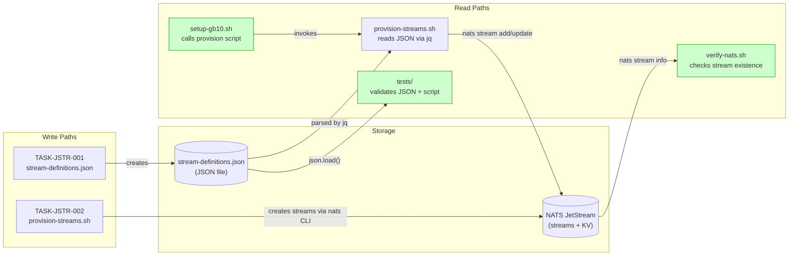
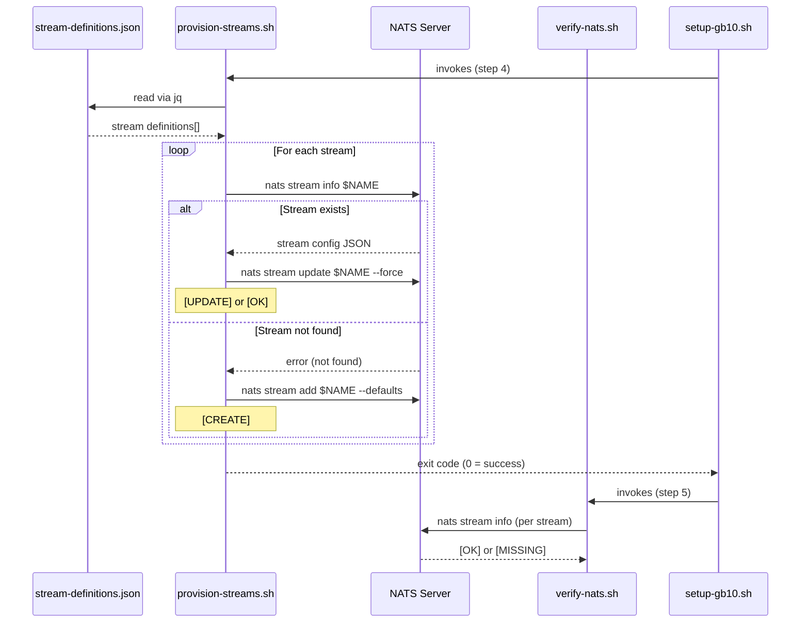
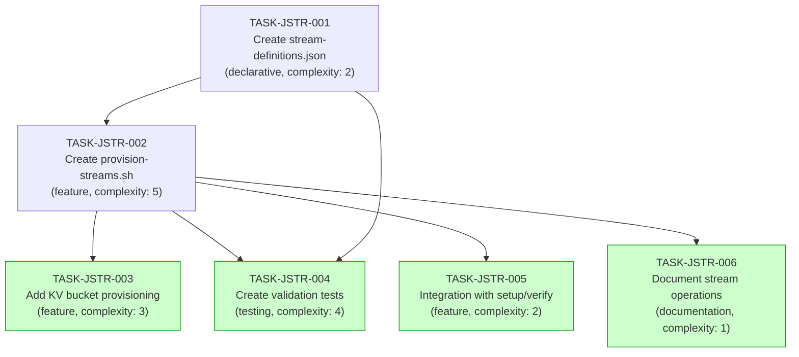

/feature-plan "JetStream Stream Definitions: PIPELINE, AGENTS, JARVIS, FLEET, NOTIFICATIONS, SYSTEM streams" \
  --context docs/design/specs/nats-infrastructure-system-spec.md
Starting feature planning for JetStream Stream Definitions: PIPELINE, AGENTS, JARVIS, FLEET, NOTIFICATIONS, SYSTEM streams.

Let me first read the context file to estimate complexity, then begin the orchestration flow.

Read nats-infrastructure-system-spec.md
Good - I have the full context. This feature is about Feature 3 from the spec: JetStream Stream Definitions (6 streams: PIPELINE, AGENTS, JARVIS, FLEET, NOTIFICATIONS, SYSTEM). Estimated complexity: ~6/10 (declarative config + idempotent provisioning script + testing).

Now proceeding with the orchestration flow.

Step 2: Review Scope Clarification (Context A)

Agent:Review scope clarification
IN
Execute clarification for feature planning.

CONTEXT TYPE: review_scope

FEATURE: "JetStream Stream Definitions: PIPELINE, AGENTS, JARVIS, FLEET, NOTIFICATIONS, SYSTEM streams"

This feature is about creating declarative JetStream stream definitions and an idempotent provisioning script for 6 core streams plus a project-scoped stream template. The streams define which NATS subjects are persisted, retention policies, max age, and max messages.

ESTIMATED COMPLEXITY: 6/10

FLAGS:
  --no-questions: false
  --with-questions: false
  --defaults: false
  --answers: none

Ask about:
1. Review focus (all/technical/architecture/performance/security)
2. Trade-off priority (speed/quality/cost/maintainability/balanced)
3. Any specific concerns to address

Present the questions to the user using the standard clarification format and wait for their answers. Return ClarificationContext with review preferences.
━━━━━━━━━━━━━━━━━━━━━━━━━━━━━━━━━━━━━━━
FEATURE PLANNING: JetStream Stream Definitions
━━━━━━━━━━━━━━━━━━━━━━━━━━━━━━━━━━━━━━━

Step 1: Review Scope Clarification

Before beginning the analysis, I need a few preferences:

Q1. Review Focus - What aspects should this analysis focus on?

[A]ll aspects - Comprehensive analysis
[T]echnical only - Implementation details, NATS CLI usage
[R] Architecture - Stream hierarchy design, subject naming
[P]erformance - Retention, storage, throughput
[S]ecurity - Account isolation, stream access
Default: [A]ll

Q2. Trade-off Priority - What are you optimizing for?

[S]peed of delivery
[Q]uality/reliability
[C]ost
[M]aintainability
[B]alanced
Default: [B]alanced

Q3. Specific Concerns - Any particular areas to address?

Examples: idempotency of provisioning script, stream naming conventions, subject hierarchy, retention policy correctness

Default: none

Please reply with your choices, e.g. A B idempotency or just press Enter for all defaults.

buildplan.md
A B idempotency
Context A recorded: Focus: All | Trade-off: Balanced | Concern: idempotency

Proceeding with Graphiti context loading and task creation in parallel.

task-create skill
Update Todos

Context A: Review scope clarification

Step 2.5: Graphiti pre-planning context loading

Step 3: Create review task via /task-create

Step 4: Execute /task-review with decision analysis

Step 5: Decision checkpoint (A/R/I/C)

Step 6: Handle user decision and generate structure
Graphiti [search_nodes]JetStream stream definitions NATS infras…
OUT
{"result":{"message":"Nodes retrieved successfully","nodes":[{"uuid":"2dbbebca-c9f4-43de-ab65-15ac9f59c3f9","name":"criteria definitions YAML","labels":["Entity","Document"],"created_at":"2026-04-07T09:42:45.074037+00:00","summary":"Criteria definitions YAML contains 6 weighted criteria and 4 detection patterns.","group_id":"architecture_decisions","attributes":{}},{"uuid":"e586a5d4-b318-4a90-8f55-57412def2b14","name":"clarification/","labels":["Entity","Location"],"created_at":"2026-04-07T09:36:04.349512+00:00","summary":"Part of FEAT-003 Clarification Engine, medium-high complexity, depends on FEAT-001, scheduled for Day 2.","group_id":"architecture_decisions","attributes":{}},{"uuid":"956d0417-240b-4c3a-ba53-9c8036019e3b","name":"criteria loader","labels":["Entity","Topic"],"created_at":"2026-04-07T09:42:45.074051+00:00","summary":"Loads criteria definitions from YAML files.","group_id":"architecture_decisions","attributes":{}},{"uuid":"ee61bd4a-0fd5-4df7-bfd3-592d3b20d89e","name":".claude/task-plans/","labels":["Entity"],"created_at":"2026-03-04T17:46:00.666093+00:00","summary":".claude/task-plans/ stores implementation plans generated by pre-loop via /task-work --design-only using SDK query(); paths use FEAT-XXX worktree ID (e.g., .guardkit/worktrees/FEAT-XXX/.claude/task-plans/) to avoid FileNotFoundError.","group_id":"architecture_decisions","attributes":{}},{"uuid":"8073dc95-285d-4da1-bbaa-69ef9bf49995","name":"criteria/","labels":["Entity","Location"],"created_at":"2026-04-07T09:36:04.349546+00:00","summary":"Part of src/architect_agent/ directory structure. Contains criteria for evaluating agent performance.","group_id":"architecture_decisions","attributes":{}}]}}
Graphiti [search_memory_facts]JetStream stream definitions NATS provis…
OUT
{"result":{"message":"Facts retrieved successfully","facts":[{"uuid":"cffdadf4-6428-4f42-abed-8a625c1438a9","group_id":"guardkit__task_outcomes","source_node_uuid":"4e9cc1fc-9edb-4438-9d28-917c937da38d","target_node_uuid":"b5bb83eb-04e9-4adc-813c-99c5af8fc156","created_at":"2026-04-03T21:59:10.920063Z","name":"EXTENDED_CODE_STYLE","fact":"nats-asyncio-service's settings.json had its code_style extended with six missing fields, making the file follow Python conventions.","episodes":["d1353c1d-42d6-4c65-95bc-f5d05a777743"],"expired_at":"2026-04-03T22:03:59.152083Z","valid_at":"2026-04-03T21:58:39.974000Z","invalid_at":"2026-04-03T22:03:12Z","attributes":{}},{"uuid":"d2236320-b24b-4c1b-b71e-79af0a683ce5","group_id":"guardkit__task_outcomes","source_node_uuid":"4e9cc1fc-9edb-4438-9d28-917c937da38d","target_node_uuid":"6f70920a-168a-42d0-91fe-14488cd09e00","created_at":"2026-04-03T21:53:34.326972Z","name":"HAS_VERSION_CONSTRAINTS_SOURCE","fact":"nats-asyncio-service uses version constraints sourced from the pyproject.toml.template file.","episodes":["5a05ea71-6a9e-4e73-b2fe-c120266ee6ea"],"expired_at":"2026-04-03T22:03:59.152077Z","valid_at":"2026-04-03T21:52:31.815168Z","invalid_at":"2026-04-03T22:03:12Z","attributes":{}},{"uuid":"8c1cb57e-5925-4ac9-8291-a98825f5d197","group_id":"guardkit__task_outcomes","source_node_uuid":"6f70920a-168a-42d0-91fe-14488cd09e00","target_node_uuid":"4e9cc1fc-9edb-4438-9d28-917c937da38d","created_at":"2026-04-03T21:53:34.326990Z","name":"HAS_EXAMPLES_CONVENTION_SOURCE","fact":"Naming convention examples for class and constant types were derived from the pyproject.toml.template file to enrich nats-asyncio-service.","episodes":["5a05ea71-6a9e-4e73-b2fe-c120266ee6ea"],"expired_at":"2026-04-03T22:03:59.152082Z","valid_at":"2026-04-03T21:52:31.815168Z","invalid_at":"2026-04-03T22:03:12Z","attributes":{}},{"uuid":"41fc5b24-46a6-4ed4-881a-5e728bf32d91","group_id":"guardkit__task_outcomes","source_node_uuid":"fb223040-6ee4-4cc3-bfbc-ebe131849967","target_node_uuid":"4a41c4e6-85a8-4031-a979-a30c8b6c4c09","created_at":"2026-04-10T12:18:44.100596Z","name":"REFER_TO","fact":"The document API-nats-subjects.md refers to TASK-9E6F (RC-5) to address remaining D1 NATS subject convention conflicts.","episodes":["ea1a2460-8c1f-4f22-9174-8959659af798"],"expired_at":null,"valid_at":"2026-04-10T12:17:25.489872Z","invalid_at":null,"attributes":{}},{"uuid":"e0a1c780-fea7-4671-ba00-b1ebc15abf9b","group_id":"guardkit__task_outcomes","source_node_uuid":"fb223040-6ee4-4cc3-bfbc-ebe131849967","target_node_uuid":"bbd86ccd-8afa-41d2-859f-3f5633b69d90","created_at":"2026-04-10T12:18:44.100523Z","name":"UPDATED_WITH","fact":"API-nats-subjects.md was updated to use fleet-standard agents.*/fleet.* patterns from the nats-core Topics registry.","episodes":["ea1a2460-8c1f-4f22-9174-8959659af798"],"expired_at":null,"valid_at":"2026-04-10T12:17:25.489872Z","invalid_at":null,"attributes":{}},{"uuid":"6df1734c-561d-405b-a3a4-c48b3c118acf","group_id":"guardkit__project_decisions","source_node_uuid":"b43cfd6d-be64-4fc7-be6c-2a8a12f3b1e9","target_node_uuid":"5aa10002-ea15-46e6-a444-b3c51b302e9a","created_at":"2026-04-10T12:40:44.672471Z","name":"REQUIRES_CONCRETE_TYPE","fact":"NatsEventPublisher requires NatsConnection for JetStream operations.","episodes":["415c7079-13a7-4fe7-9501-d86f59970c33"],"expired_at":null,"valid_at":"2026-04-10T12:39:19Z","invalid_at":null,"attributes":{}},{"uuid":"75d56a7b-8e15-4283-ae4b-1e574687f04e","group_id":"guardkit__project_decisions","source_node_uuid":"1ed05c88-69a3-49ff-a4b2-6519094dd6a2","target_node_uuid":"70236794-6a98-45ab-83df-719193316058","created_at":"2026-04-10T12:40:44.672582Z","name":"CONTEXT_OF_TASK","fact":"TASK-W7 is the context for the NATS Fleet Integration for dotnet-functional-fastendpoints-exemplar project.","episodes":["415c7079-13a7-4fe7-9501-d86f59970c33"],"expired_at":null,"valid_at":"2026-04-10T12:39:19Z","invalid_at":null,"attributes":{}},{"uuid":"634e41a6-cc00-4c6f-8d48-ff56b0777483","group_id":"guardkit__project_decisions","source_node_uuid":"47270d17-fa19-4d65-bb9c-f38cb87fe87d","target_node_uuid":"e8544046-8815-4d77-8923-774ec51784a7","created_at":"2026-04-10T11:02:31.621380Z","name":"ENSURES_IDEMPOTENCY","fact":"DbUp journal table (schemaversions) ensures idempotency of Schema migrations.","episodes":["ef456032-e9ff-42d2-b4e6-bc5a2ec383cc"],"expired_at":null,"valid_at":"2026-04-10T11:00:25.759290Z","invalid_at":null,"attributes":{}},{"uuid":"adf2bad1-cb71-475b-8f3e-76c7c40676eb","group_id":"guardkit__project_decisions","source_node_uuid":"3a30491f-4b05-44cf-85a7-025eeb5cfa4e","target_node_uuid":"9826cae1-2420-4392-a718-4416ba5baf8e","created_at":"2026-04-10T12:40:44.672601Z","name":"CONSTRUCTION_NOT_ALLOWED_IN_INTERFACE","fact":"Construction of NatsJSContext is not allowed within the INatsConnection interface in NATS.Net 2.x.","episodes":["415c7079-13a7-4fe7-9501-d86f59970c33"],"expired_at":null,"valid_at":"2026-04-10T12:39:19Z","invalid_at":null,"attributes":{}},{"uuid":"35c3583a-89f2-44b8-a45e-71b610191ce6","group_id":"guardkit__project_decisions","source_node_uuid":"a5451cb7-a557-4b92-8fe1-75363eaee60c","target_node_uuid":"3a30491f-4b05-44cf-85a7-025eeb5cfa4e","created_at":"2026-04-10T12:40:44.672540Z","name":"USES_INTERFACE","fact":"NatsAgentClient uses INatsConnection.","episodes":["415c7079-13a7-4fe7-9501-d86f59970c33"],"expired_at":null,"valid_at":"2026-04-10T12:39:19Z","invalid_at":null,"attributes":{}},{"uuid":"68b8da0d-b13c-4c63-ba0e-f8b9f9730fd5","group_id":"architecture_decisions","source_node_uuid":"ff40d47c-5ccd-4882-9bc0-9b438ecb898c","target_node_uuid":"2dbbebca-c9f4-43de-ab65-15ac9f59c3f9","created_at":"2026-04-07T09:47:27.252307Z","name":"HAS_COMPONENT","fact":"The LLM Client includes criteria definitions YAML.","episodes":["669c4567-f620-4385-a36e-958178d48b00"],"expired_at":null,"valid_at":"2026-04-07T09:41:50.580062Z","invalid_at":null,"attributes":{}},{"uuid":"9bfd6c6c-bd7f-485a-9cd1-348c7f24bc05","group_id":"architecture_decisions","source_node_uuid":"400b9e7b-1321-407a-b68b-e073d4b2b659","target_node_uuid":"44add345-5caa-414b-899a-a3d6296abfb2","created_at":"2026-03-04T22:58:59.287001Z","name":"USES_ID_FOR_PATH","fact":"In feature mode, filesystem paths use FEAT-XXX worktree ID.","episodes":["9582a2b0-d018-4b76-910e-7a3ba96bea5f","894308c0-784f-4031-9b55-d3f826cb687d","b5d76708-0478-4feb-b830-5c85480049a9","54c89206-637b-4ee2-aaea-1b572fd5655b","ae36eeb7-ef47-482c-ab91-82545a761a57"],"expired_at":null,"valid_at":"2026-03-04T22:58:15.070883Z","invalid_at":null,"attributes":{}},{"uuid":"15869f49-d07a-487f-a533-94059597d313","group_id":"architecture_decisions","source_node_uuid":"6d6e34e4-29f5-4213-adf7-4c6dfd7f87b4","target_node_uuid":"2dbbebca-c9f4-43de-ab65-15ac9f59c3f9","created_at":"2026-04-07T09:47:27.252703Z","name":"HAS_SUBTASK","fact":"The Session types include the criteria definitions YAML.","episodes":["669c4567-f620-4385-a36e-958178d48b00"],"expired_at":null,"valid_at":"2026-04-07T09:41:50.580062Z","invalid_at":null,"attributes":{}},{"uuid":"67f65856-f291-438f-a207-c3061bc09fc6","group_id":"architecture_decisions","source_node_uuid":"b83ca097-6d4c-451f-bdb6-b11e242839e9","target_node_uuid":"31787a55-afc4-4057-9c88-59759964cf6d","created_at":"2026-03-05T16:21:55.618912Z","name":"EXECUTES_IN_SHARED_WORKTREE","fact":"Player executes within the shared feature-mode worktree at .guardkit/worktrees/FEAT-XXX/.","episodes":["b5d76708-0478-4feb-b830-5c85480049a9"],"expired_at":"2026-03-06T15:13:22.463507Z","valid_at":"2026-03-05T16:21:14.836261Z","invalid_at":"2026-03-06T15:12:29.123172Z","attributes":{}},{"uuid":"668f20db-2857-4f8d-bc1a-fe750d547e49","group_id":"architecture_decisions","source_node_uuid":"b51f12d6-da24-4d91-a02c-756441541c53","target_node_uuid":"44add345-5caa-414b-899a-a3d6296abfb2","created_at":"2026-03-04T22:58:59.287037Z","name":"HAS_WORKTREE_DIRECTORY","fact":"The worktree directory is named after the FEAT-XXX feature ID and created at .guardkit/worktrees/FEAT-XXX/.","episodes":["9582a2b0-d018-4b76-910e-7a3ba96bea5f"],"expired_at":null,"valid_at":"2026-03-04T22:58:15.070883Z","invalid_at":null,"attributes":{}}]}}
Update Todos

Context A: Review scope clarification

Step 2.5: Graphiti pre-planning context loading

Step 3: Create review task via /task-create

Step 4: Execute /task-review with decision analysis

Step 5: Decision checkpoint (A/R/I/C)

Step 6: Handle user decision and generate structure
[Graphiti] Feature context loaded: 3 items

Similar features: 0
Architecture context: 2 (NATS subject conventions, JetStream operations)
Past outcomes: 1 (idempotency pattern from DbUp journal)
Now creating the review task.

Bash Check if tasks directory exists
IN
ls /Users/richardwoollcott/Projects/appmilla_github/nats-infrastructure/tasks/ 2>/dev/null || echo "NO_TASKS_DIR"

OUT
backlog
blocked
completed
design_approved
in_progress
in_review
Bash List existing backlog tasks
IN
ls /Users/richardwoollcott/Projects/appmilla_github/nats-infrastructure/tasks/backlog/ 2>/dev/null

OUT
nats-server-config
TASK-NATS-003-create-env-example.md
TASK-REV-1A6B-plan-docker-compose-deployment.md
TASK-REV-69BD-plan-nats-server-configuration.md
Bash Generate unique task ID hash
IN
python3 -c "import hashlib, time; h = hashlib.sha256(f'Plan JetStream Stream Definitions {time.time()}'.encode()).hexdigest()[:4].upper(); print(h)"

OUT
E14C
Write TASK-REV-E14C-plan-jetstream-stream-definitions.md
42 lines
---
id: TASK-REV-E14C
title: "Plan: JetStream Stream Definitions - PIPELINE, AGENTS, JARVIS, FLEET, NOTIFICATIONS, SYSTEM streams"
status: backlog
created: 2026-04-13T10:00:00Z
updated: 2026-04-13T10:00:00Z
priority: high
tags: [jetstream, nats, streams, infrastructure]
task_type: review
complexity: 6
test_results:
  status: pending
  coverage: null
  last_run: null
---

# Task: Plan JetStream Stream Definitions

## Description

Analyze and plan the implementation of 6 core JetStream stream definitions (PIPELINE, AGENTS, JARVIS, FLEET, NOTIFICATIONS, SYSTEM) plus a project-scoped stream template (FINPROXY). This includes creating a declarative stream-definitions.json, an idempotent provision-streams.sh script, and validation tests for stream retention policies.

## Context

- System spec: docs/design/specs/nats-infrastructure-system-spec.md (Feature 3)
- Deployment target: Dell DGX Spark GB10
- NATS server with JetStream enabled (max_mem: 1GB, max_file: 10GB)
- Streams serve the Ship's Computer agent fleet

## Review Focus

- All aspects (comprehensive)
- Trade-off priority: Balanced
- Specific concern: Idempotency of provisioning script

## Acceptance Criteria

- [ ] Technical options analyzed for stream provisioning approach
- [ ] Idempotency strategy for stream creation/updates evaluated
- [ ] Retention policies validated against use cases
- [ ] Implementation tasks defined with clear dependencies
Step 2: Review task created: TASK-REV-E14C


Task Created: TASK-REV-E14C
Title: Plan: JetStream Stream Definitions
Location: tasks/backlog/TASK-REV-E14C-plan-jetstream-stream-definitions.md
Proceeding to review analysis...

Update Todos

Context A: Review scope clarification

Step 2.5: Graphiti pre-planning context loading

Step 3: Create review task via /task-create

Step 4: Execute /task-review with decision analysis

Step 5: Decision checkpoint (A/R/I/C)

Step 6: Handle user decision and generate structure
task-review skill
Now executing the decision review analysis. Context A has been recorded (Focus: All, Trade-off: Balanced, Concern: Idempotency). Let me perform the review analysis using the spec context.

Agent:Decision review analysis for JetStream streams
IN
You are performing a DECISION REVIEW ANALYSIS for task TASK-REV-E14C: "Plan: JetStream Stream Definitions - PIPELINE, AGENTS, JARVIS, FLEET, NOTIFICATIONS, SYSTEM streams".

REVIEW SCOPE (from user clarification):
- Focus: All aspects (comprehensive)
- Trade-off Priority: Balanced
- Specific Concern: Idempotency of provisioning script

KNOWLEDGE GRAPH CONTEXT (from Graphiti):
- NATS subject conventions use fleet-standard agents.*/fleet.* patterns
- NatsEventPublisher requires NatsConnection for JetStream operations
- Idempotency pattern precedent: DbUp journal table ensures idempotency of schema migrations

CONTEXT: This is the nats-infrastructure repo — config/ops only, no application code. Deployed on Dell DGX Spark GB10 (128GB). Single NATS server, not clustered (replicas: 1).

FEATURE SPEC (from docs/design/specs/nats-infrastructure-system-spec.md, Feature 3):

6 core streams to provision:
| Stream | Subjects | Retention | Max Age | Max Messages | Purpose |
|--------|----------|-----------|---------|-------------|---------|
| PIPELINE | pipeline.> | WorkQueue | 7 days | 10,000 | Dev pipeline events |
| AGENTS | agents.> | Limits | 24 hours | 5,000 | Agent status, approvals, commands |
| JARVIS | jarvis.> | Limits | 1 hour | 1,000 | Intent classification, dispatch |
| NOTIFICATIONS | notifications.> | WorkQueue | 24 hours | 1,000 | Outbound notifications |
| SYSTEM | system.> | Limits | 1 hour | 500 | Health checks, config |
| FLEET | fleet.> | Limits | 1 hour | 5,000 | Agent registration, heartbeats |

Plus 1 project-scoped stream template:
| FINPROXY | finproxy.> | WorkQueue | — | — | Client-scoped isolation |

The spec also shows a provision-streams.sh script using `nats stream add` CLI commands.

Repository structure already has:
- streams/ directory (for provision-streams.sh and stream-definitions.json)
- config/ directory (nats-server.conf, accounts/)
- docker-compose.yml

TASK: Analyze technical options and produce a decision review with 2-3 approaches. Focus especially on:

1. **Stream Definition Format**: JSON file vs YAML vs inline shell script vs nats-server.conf declarative
2. **Provisioning Approach**: Shell script with `nats` CLI vs NATS server declarative config vs Terraform NATS provider vs custom Python script
3. **Idempotency Strategy**: How to make provisioning safe to re-run (--force update, check-then-create, nats stream add with --defaults, server-side declarative)
4. **Project-Scoped Stream Template**: How to handle adding new client project streams (parameterized script vs template file)

For each option, assess:
- Complexity (1-10)
- Operational simplicity (for a small team running on a single GB10)
- Idempotency guarantees
- Alignment with the existing spec (which already shows `nats stream add` approach)

Provide a clear RECOMMENDED APPROACH with rationale.

Also provide an IMPLEMENTATION BREAKDOWN of 4-6 tasks needed to implement the recommended approach, with complexity scores and dependencies.

Format your output as a structured technical review with clear sections.
Bash
IN
ls -la /Users/richardwoollcott/Projects/appmilla_github/nats-infrastructure/docs/design/specs/ 2>/dev/null

OUT
total 40
drwxr-xr-x  3 richardwoollcott  staff     96 Apr  4 13:31 .
drwxr-xr-x  4 richardwoollcott  staff    128 Apr  1 08:06 ..
-rw-r--r--  1 richardwoollcott  staff  19375 Apr  4 13:31 nats-infrastructure-system-spec.md
Read accounts.conf.template
Bash
IN
ls -laR /Users/richardwoollcott/Projects/appmilla_github/nats-infrastructure/migrations/ 2>/dev/null

OUT
total 0
drwxr-xr-x@  2 richardwoollcott  staff   64 Apr  4 13:27 .
drwxr-xr-x  18 richardwoollcott  staff  576 Apr  8 10:30 ..
Read verify-nats.sh
Read .env.example
Bash
IN
ls -laR /Users/richardwoollcott/Projects/appmilla_github/nats-infrastructure/docs/design/decisions/ 2>/dev/null; echo "==="; cat /Users/richardwoollcott/Projects/appmilla_github/nats-infrastructure/.env.example 2>/dev/null

OUT
total 16
drwxr-xr-x  4 richardwoollcott  staff  128 Apr  1 08:13 .
drwxr-xr-x  4 richardwoollcott  staff  128 Apr  1 08:06 ..
-rw-r--r--@ 1 richardwoollcott  staff  791 Apr  1 08:13 ADR-001-standalone-infra-repo.md
-rw-r--r--@ 1 richardwoollcott  staff  984 Apr  1 08:13 ADR-002-account-multi-tenancy.md
===
# =============================================================================
# NATS Infrastructure — Environment Variables
# =============================================================================
# Copy this file to .env and replace placeholder values with real passwords:
#
#   cp .env.example .env
#   # Edit .env with your actual passwords
#   docker compose up -d
#
# The .env file is gitignored — never commit real passwords.
# See config/accounts/accounts.conf.template for how these are used.
# =============================================================================

# ---------------------------------------------------------------------------
# NATS Account Passwords
# ---------------------------------------------------------------------------
# These passwords are substituted into config/accounts/accounts.conf.template
# at container startup by scripts/docker-entrypoint.sh (via envsubst).
# All four variables are REQUIRED — the entrypoint will refuse to start if
# any are missing.

# Rich's password for the APPMILLA account.
# Account: APPMILLA | User: rich | Access: full publish/subscribe to all subjects (>)
# No default — must be set to a strong, unique password.
RICH_NATS_PASSWORD=changeme

# James's password for the APPMILLA account.
# Account: APPMILLA | User: james | Access: full publish/subscribe to all subjects (>)
# No default — must be set to a strong, unique password.
JAMES_NATS_PASSWORD=changeme

# Mark's password for the FINPROXY account.
# Account: FINPROXY | User: mark | Access: publish/subscribe scoped to finproxy.> only
# No default — must be set to a strong, unique password.
MARK_NATS_PASSWORD=changeme

# Admin password for the SYS (system) account.
# Account: SYS | User: admin | Access: NATS server administration and monitoring
# No default — must be set to a strong, unique password.
ADMIN_NATS_PASSWORD=changeme
Read TASK-REV-69BD-plan-nats-server-configuration.md
Read TASK-REV-1A6B-plan-docker-compose-deployment.md
Bash
IN
ls -la /Users/richardwoollcott/Projects/appmilla_github/nats-infrastructure/docs/design/

OUT
total 0
drwxr-xr-x  4 richardwoollcott  staff  128 Apr  1 08:06 .
drwxr-xr-x  6 richardwoollcott  staff  192 Apr 13 18:28 ..
drwxr-xr-x  4 richardwoollcott  staff  128 Apr  1 08:13 decisions
drwxr-xr-x  3 richardwoollcott  staff   96 Apr  4 13:31 specs
━━━━━━━━━━━━━━━━━━━━━━━━━━━━━━━━━━━━━━━━━━━━
TECHNICAL OPTIONS ANALYSIS: TASK-REV-E14C
━━━━━━━━━━━━━━━━━━━━━━━━━━━━━━━━━━━━━━━━━━━━

Feature: JetStream Stream Definitions (PIPELINE, AGENTS, JARVIS, FLEET, NOTIFICATIONS, SYSTEM)
Review Mode: Decision | Depth: Standard | Focus: All | Trade-off: Balanced

Decision 1: Stream Definition Format
Option	Complexity	Ops Simplicity	Spec Alignment	Verdict
A. Inline Shell	2/10	High	Partial	Simple but tangled
B. JSON + Shell (Rec.)	4/10	Good	Exact match	Best balance
C. Server Declarative	3/10	Highest	Deviates	Timing issues, less flexible
D. Terraform	7/10	Low	Major deviation	Overkill for single server
Recommended: Option B (JSON + Shell) -- The spec explicitly names both stream-definitions.json and provision-streams.sh in the repo structure. jq is already used by existing scripts (verify-nats.sh).

Decision 2: Idempotency Strategy (User's specific concern)
Strategy	Complexity	Idempotency	Change Propagation	Verdict
1. add + suppress errors	1/10	Partial	None	First-run only
2. Check-then-create/update (Rec.)	4/10	Full	Yes	Best balance
3. Declarative diff + dry-run	7/10	Full	Yes, auditable	Overkill
4. Journal-based migrations	6/10	Full	Via versions	Wrong abstraction
Recommended: Strategy 2 (Check-Then-Create-or-Update)

Directly satisfies TASK-12 from spec: "Make provision idempotent (skip existing streams or update them)"
Pattern: nats stream info to check existence, nats stream add --defaults to create, nats stream update --force to update
Logs every action: [CREATE], [UPDATE], [OK], [ERROR]
Optional --dry-run flag for safe preview (trivial to add)
Handles the edge case where nats stream update fails on subject changes (log error, continue)
Decision 3: Project-Scoped Streams
Recommended: All streams (including FINPROXY) in a single stream-definitions.json with a "scope": "project" field. At current scale (1 project stream), separate files are premature.

Risk Alert: Account-Scoped Stream Access
Streams created by the APPMILLA user are in the APPMILLA account and not visible to FINPROXY users. The provisioning script needs per-stream credential support (or an optional account field in JSON) so FINPROXY's stream is created under the FINPROXY account.

Implementation Breakdown (Recommended Approach)
#	Task	Complexity	Dependencies
1	Create stream-definitions.json with all 7 streams	2/10	None
2	Create provision-streams.sh with idempotent check/create/update	5/10	Task 1
3	Add KV bucket provisioning (agent-status, agent-registry, etc.)	3/10	Task 2
4	Create validation tests (JSON schema, spec compliance, shellcheck)	4/10	Tasks 1, 2
5	Integration with setup-gb10.sh and verify-nats.sh	2/10	Task 2
6	Document stream operations in README	1/10	Task 2
Parallel execution: Tasks 3, 4, 5, 6 can all run in parallel after Task 2 completes.

Estimated complexity: 6/10 overall

━━━━━━━━━━━━━━━━━━━━━━━━━━━━━━━━━━━━━━━━━━━━

Update Todos

Context A: Review scope clarification

Step 2.5: Graphiti pre-planning context loading

Step 3: Create review task via /task-create

Step 4: Execute /task-review with decision analysis

Step 5: Decision checkpoint (A/R/I/C)

Step 6: Handle user decision and generate structure
AskUserQuestion
OUT
User has answered your questions: "Review complete. What would you like to do?"="[I]mplement (Recommended)". You can now continue with the user's answers in mind.
User chose [I]mplement. Proceeding to collect implementation preferences, then generate the feature structure.

AskUserQuestion
OUT
User has answered your questions: "Which approach should the implementation tasks follow?"="JSON + Shell with Check-Create-Update (Recommended)", "What testing depth for the implementation tasks?"="Standard (Recommended)". You can now continue with the user's answers in mind.
Update Todos

Context A: Review scope clarification

Step 2.5: Graphiti pre-planning context loading

Step 3: Create review task via /task-create

Step 4: Execute /task-review with decision analysis

Step 5: Decision checkpoint (A/R/I/C)

Step 6: Create feature subfolder and task files

Step 7: Generate IMPLEMENTATION-GUIDE.md with Mermaid diagrams

Step 8: Generate structured YAML feature file
Implementation preferences recorded:

Approach: JSON + Shell with Check-Create-Update
Testing: Standard (quality gates)
Now generating the feature structure.

Bash Create feature subfolder
IN
mkdir -p /Users/richardwoollcott/Projects/appmilla_github/nats-infrastructure/tasks/backlog/jetstream-stream-definitions

OUT
(Bash completed with no output)
Write TASK-JSTR-001-create-stream-definitions-json.md
75 lines
---
id: TASK-JSTR-001
title: "Create stream-definitions.json with all 7 streams"
task_type: declarative
parent_review: TASK-REV-E14C
feature_id: FEAT-JSTR
wave: 1
implementation_mode: direct
complexity: 2
dependencies: []
status: pending
priority: high
tags: [jetstream, streams, json]
estimated_minutes: 30
---

# Task: Create stream-definitions.json

## Description

Create `streams/stream-definitions.json` with declarative definitions for all 7 JetStream streams (6 core + 1 project-scoped). This file is the single source of truth for stream configuration, consumed by `provision-streams.sh`.

## Context

From the system spec (Feature 3), the streams are:

| Stream | Subjects | Retention | Max Age | Max Messages | Scope |
|--------|----------|-----------|---------|-------------|-------|
| PIPELINE | `pipeline.>` | WorkQueue | 7 days | 10,000 | core |
| AGENTS | `agents.>` | Limits | 24 hours | 5,000 | core |
| JARVIS | `jarvis.>` | Limits | 1 hour | 1,000 | core |
| NOTIFICATIONS | `notifications.>` | WorkQueue | 24 hours | 1,000 | core |
| SYSTEM | `system.>` | Limits | 1 hour | 500 | core |
| FLEET | `fleet.>` | Limits | 1 hour | 5,000 | core |
| FINPROXY | `finproxy.>` | WorkQueue | 24 hours | 5,000 | project |

All streams use `file` storage, `replicas: 1` (single server).

## JSON Structure

Each stream object maps directly to `nats stream add/update` CLI flags:

```json
{
  "streams": [
    {
      "name": "PIPELINE",
      "subjects": ["pipeline.>"],
      "retention": "work",
      "max_age": "7d",
      "max_msgs": 10000,
      "storage": "file",
      "replicas": 1,
      "scope": "core",
      "description": "Dev pipeline events"
    }
  ]
}
```

## Acceptance Criteria

- [ ] File created at `streams/stream-definitions.json`
- [ ] All 6 core streams defined with exact spec values
- [ ] FINPROXY project stream included with `"scope": "project"` and reasonable defaults (24h, 5000)
- [ ] All required fields present: name, subjects, retention, max_age, max_msgs, storage, replicas
- [ ] JSON is valid (parseable by `jq`)
- [ ] Retention values use NATS CLI format: `work` (WorkQueue) or `limits` (Limits)

## Implementation Notes

- The spec does not specify max_age or max_msgs for FINPROXY. Use 24h and 5000 as reasonable defaults.
- The `scope` field is metadata for tooling/documentation, not consumed by NATS CLI.
- Consider adding an optional `account` field for FINPROXY to support per-account provisioning.
Write TASK-JSTR-002-create-provision-streams-script.md
96 lines
---
id: TASK-JSTR-002
title: "Create provision-streams.sh with idempotent check/create/update"
task_type: feature
parent_review: TASK-REV-E14C
feature_id: FEAT-JSTR
wave: 2
implementation_mode: task-work
complexity: 5
dependencies: [TASK-JSTR-001]
status: pending
priority: high
tags: [jetstream, provisioning, idempotency, shell]
estimated_minutes: 60
consumer_context:
  - task: TASK-JSTR-001
    consumes: stream-definitions.json
    framework: "jq + nats CLI"
    driver: "jq"
    format_note: "JSON array at .streams[] with fields: name, subjects, retention, max_age, max_msgs, storage, replicas"
---

# Task: Create provision-streams.sh with idempotent provisioning

## Description

Create `streams/provision-streams.sh` that reads `stream-definitions.json` via `jq`, loops through stream definitions, and applies the check-then-create-or-update idempotency pattern. The script must be safe to run multiple times -- on first deploy, on reboot, and after stream definition changes.

## Idempotency Pattern

For each stream in JSON:
1. Check if stream exists: `nats stream info $NAME --json 2>/dev/null`
2. If not exists: `nats stream add $NAME ... --defaults` -> log `[CREATE]`
3. If exists: `nats stream update $NAME ... --force` -> log `[UPDATE]`
4. On error: log `[ERROR]` and continue to next stream (do not abort)

## Requirements

- Read stream definitions from `streams/stream-definitions.json`
- Support `NATS_URL` env var (default: `nats://localhost:4222`)
- Support `NATS_CREDS` env var for optional credentials
- Support `--dry-run` flag for safe preview (shows what would happen without acting)
- Log every action with prefixed format: `[CREATE] PIPELINE`, `[UPDATE] AGENTS`, `[OK] FLEET`
- Use `set -euo pipefail` for strict error handling
- Handle update failures gracefully (log and continue to next stream)
- Wait for NATS health before attempting provisioning (health check loop)
- Print summary at end: `N created, M updated, K already current, E errors`

## Acceptance Criteria

- [ ] Script reads all streams from `stream-definitions.json`
- [ ] First run creates all 7 streams successfully
- [ ] Second run detects existing streams and reports `[OK]` or `[UPDATE]` (no errors)
- [ ] Changing a value in JSON (e.g., max_age) propagates on next run via `[UPDATE]`
- [ ] `--dry-run` flag shows planned actions without modifying anything
- [ ] Script exits 0 when all streams provisioned, non-zero only on fatal errors
- [ ] All modified files pass project-configured lint/format checks with zero errors

## Seam Tests

The following seam test validates the integration contract with the producer task. Implement this test to verify the boundary before integration.

```python
"""Seam test: verify stream-definitions.json contract from TASK-JSTR-001."""
import json
import pytest


@pytest.mark.seam
@pytest.mark.integration_contract("stream-definitions.json")
def test_stream_definitions_json_format():
    """Verify stream-definitions.json matches the expected format.

    Contract: JSON array at .streams[] with fields: name, subjects, retention, max_age, max_msgs, storage, replicas
    Producer: TASK-JSTR-001
    """
    with open("streams/stream-definitions.json") as f:
        data = json.load(f)

    assert "streams" in data, "Top-level 'streams' key must exist"
    assert len(data["streams"]) >= 7, f"Expected at least 7 streams, got {len(data['streams'])}"

    required_fields = {"name", "subjects", "retention", "max_age", "max_msgs", "storage", "replicas"}
    for stream in data["streams"]:
        missing = required_fields - set(stream.keys())
        assert not missing, f"Stream {stream.get('name', '?')} missing fields: {missing}"
        assert stream["retention"] in ("work", "limits"), f"Invalid retention: {stream['retention']}"
```

## Implementation Notes

- The `nats stream update --force` flag bypasses interactive confirmation
- `nats stream update` can modify most parameters but CANNOT change subject filters on a stream with data
- For the FINPROXY project-scoped stream, the script may need to use different credentials (account-scoped access). Handle via optional `account` field in JSON.
- `jq` is required; include a check at script start: `command -v jq >/dev/null || { echo "jq required"; exit 1; }`
Write TASK-JSTR-003-add-kv-bucket-provisioning.md
95 lines
---
id: TASK-JSTR-003
title: "Add KV bucket provisioning to provision-streams.sh"
task_type: feature
parent_review: TASK-REV-E14C
feature_id: FEAT-JSTR
wave: 3
implementation_mode: direct
complexity: 3
dependencies: [TASK-JSTR-002]
status: pending
priority: normal
tags: [jetstream, kv, provisioning]
estimated_minutes: 30
consumer_context:
  - task: TASK-JSTR-001
    consumes: stream-definitions.json
    framework: "jq + nats CLI"
    driver: "jq"
    format_note: "JSON array at .kv_buckets[] with fields: name, ttl, description"
---

# Task: Add KV bucket provisioning

## Description

Extend `streams/stream-definitions.json` and `streams/provision-streams.sh` to also provision the 4 KV buckets from the system spec (Feature 6). Apply the same idempotency pattern: check-then-create-or-update.

## KV Buckets (from spec)

| Bucket | Purpose | TTL |
|--------|---------|-----|
| `agent-status` | Last known status per agent | None (persistent) |
| `agent-registry` | Fleet routing table -- agent capability manifests | None (persistent) |
| `pipeline-state` | Current pipeline state per feature_id | 7 days |
| `jarvis-session` | Jarvis conversation session context | 1 hour |

## JSON Extension

Add a `kv_buckets` array to `stream-definitions.json`:

```json
{
  "streams": [...],
  "kv_buckets": [
    {
      "name": "agent-status",
      "ttl": null,
      "description": "Last known status per agent"
    }
  ]
}
```

## Provisioning Pattern

- Use `nats kv info BUCKET` to check existence
- Use `nats kv add BUCKET` to create (with `--ttl` if specified)
- Use `nats kv update BUCKET` to update TTL on existing buckets
- Same `[CREATE]`/`[UPDATE]`/`[OK]` logging pattern

## Acceptance Criteria

- [ ] All 4 KV buckets defined in `stream-definitions.json`
- [ ] `provision-streams.sh` creates KV buckets after streams
- [ ] Idempotent: re-running does not error on existing buckets
- [ ] TTL values applied correctly (null = no TTL, persistent)
- [ ] All modified files pass project-configured lint/format checks with zero errors

## Seam Tests

```python
"""Seam test: verify kv_buckets section in stream-definitions.json."""
import json
import pytest


@pytest.mark.seam
@pytest.mark.integration_contract("stream-definitions.json")
def test_kv_buckets_json_format():
    """Verify kv_buckets matches the expected format.

    Contract: JSON array at .kv_buckets[] with fields: name, ttl, description
    Producer: TASK-JSTR-001
    """
    with open("streams/stream-definitions.json") as f:
        data = json.load(f)

    assert "kv_buckets" in data, "Top-level 'kv_buckets' key must exist"
    assert len(data["kv_buckets"]) >= 4, f"Expected at least 4 KV buckets, got {len(data['kv_buckets'])}"

    for bucket in data["kv_buckets"]:
        assert "name" in bucket, f"KV bucket missing 'name' field"
```
Write TASK-JSTR-004-create-validation-tests.md
63 lines
---
id: TASK-JSTR-004
title: "Create validation tests for stream definitions and provisioning"
task_type: testing
parent_review: TASK-REV-E14C
feature_id: FEAT-JSTR
wave: 3
implementation_mode: task-work
complexity: 4
dependencies: [TASK-JSTR-001, TASK-JSTR-002]
status: pending
priority: high
tags: [testing, validation, streams, shellcheck]
estimated_minutes: 45
---

# Task: Create validation tests

## Description

Create pytest tests that validate stream definitions and the provisioning script without requiring a running NATS server. Follow the existing test pattern in `tests/test_nats_server_conf.py`.

## Test Scope

### 1. JSON Schema Validation (`tests/test_stream_definitions.py`)

- `stream-definitions.json` is valid JSON
- All required fields present for each stream (name, subjects, retention, max_age, max_msgs, storage, replicas)
- All 6 core streams from the spec are defined (PIPELINE, AGENTS, JARVIS, FLEET, NOTIFICATIONS, SYSTEM)
- FINPROXY project-scoped stream is defined
- Retention values are valid (`work` or `limits`)
- Max age values use valid NATS duration format (e.g., `7d`, `24h`, `1h`)
- No duplicate stream names
- All core subjects follow dot-separated hierarchical naming

### 2. Spec Compliance (`tests/test_stream_definitions.py`)

- PIPELINE retention is `work` (WorkQueue) per spec
- AGENTS max_age is `24h` per spec
- JARVIS max_msgs is `1000` per spec
- All streams have `replicas: 1` (single server)
- All streams have `storage: file`

### 3. Script Validation (`tests/test_provision_streams.py`)

- `provision-streams.sh` exists and is executable
- Script passes `shellcheck` (if available)
- Script contains required components: NATS_URL variable, jq dependency check, health check wait

## Acceptance Criteria

- [ ] `tests/test_stream_definitions.py` validates JSON structure and spec compliance
- [ ] `tests/test_provision_streams.py` validates script exists and passes shellcheck
- [ ] All tests pass with `pytest tests/ -v`
- [ ] Tests follow existing pattern: no running NATS server required
- [ ] Test names follow convention: `test_<subject>_<scenario>_<expected>`

## Implementation Notes

- Use `json.load()` for JSON parsing tests
- Use `subprocess.run(["shellcheck", ...])` for shell validation (skip if shellcheck not installed)
- Reference `tests/test_nats_server_conf.py` for the established test pattern
Write TASK-JSTR-005-integration-with-setup-and-verify-scripts.md
62 lines
---
id: TASK-JSTR-005
title: "Integration with setup-gb10.sh and verify-nats.sh"
task_type: feature
parent_review: TASK-REV-E14C
feature_id: FEAT-JSTR
wave: 3
implementation_mode: direct
complexity: 2
dependencies: [TASK-JSTR-002]
status: pending
priority: normal
tags: [integration, setup, verification]
estimated_minutes: 20
---

# Task: Integration with setup and verify scripts

## Description

Ensure `provision-streams.sh` is called from `setup-gb10.sh` (step 4 in the spec) and extend `verify-nats.sh` to check that expected streams exist after provisioning.

## Changes

### setup-gb10.sh

Add stream provisioning as step 4 (after Docker Compose up, before verification):

```bash
# 4. Provision JetStream streams
echo "Provisioning JetStream streams..."
./streams/provision-streams.sh
```

Note: `setup-gb10.sh` may not exist yet (depends on TASK-REV-1A6B Docker Compose feature). If it doesn't exist, create a stub that will be extended later.

### verify-nats.sh

Add a Check 5 section that verifies expected streams exist:

```bash
# Check 5: JetStream streams provisioned
if command -v nats &> /dev/null; then
    echo "Check 5: JetStream streams..."
    EXPECTED_STREAMS="PIPELINE AGENTS JARVIS FLEET NOTIFICATIONS SYSTEM FINPROXY"
    for stream in $EXPECTED_STREAMS; do
        if nats stream info "$stream" --json &>/dev/null; then
            echo "  [OK] $stream"
        else
            echo "  [MISSING] $stream"
        fi
    done
fi
```

## Acceptance Criteria

- [ ] `provision-streams.sh` called from setup script at correct point in sequence
- [ ] `verify-nats.sh` lists all expected streams with `[OK]`/`[MISSING]` status
- [ ] Stream verification is gated on `nats` CLI availability (graceful skip)
- [ ] All modified files pass project-configured lint/format checks with zero errors
Write TASK-JSTR-006-document-stream-operations.md
42 lines
---
id: TASK-JSTR-006
title: "Document stream operations in README"
task_type: documentation
parent_review: TASK-REV-E14C
feature_id: FEAT-JSTR
wave: 3
implementation_mode: direct
complexity: 1
dependencies: [TASK-JSTR-002]
status: pending
priority: low
tags: [documentation, readme, streams]
estimated_minutes: 15
---

# Task: Document stream operations in README

## Description

Add a "JetStream Streams" section to README.md documenting how to run provisioning, add new project streams, verify streams, and the idempotency guarantees.

## Sections to Add

### JetStream Streams

- **Overview**: Brief description of the 6 core streams and their purpose
- **Provisioning**: How to run `provision-streams.sh` (first time and re-runs)
- **Dry Run**: How to preview changes with `--dry-run`
- **Adding a Project Stream**: How to add a new client stream (add entry to JSON, re-run script)
- **KV Buckets**: Brief description of the 4 KV buckets and their purpose
- **Idempotency**: Explanation that the script is safe to re-run and will update changed definitions
- **Verification**: How to check stream status with `verify-nats.sh` or `nats stream ls`

## Acceptance Criteria

- [ ] README.md has a "JetStream Streams" section
- [ ] All 6 core streams listed with purpose
- [ ] Provisioning commands documented
- [ ] Idempotency guarantees explained
- [ ] Project stream addition process documented
Now generating the IMPLEMENTATION-GUIDE.md with mandatory Mermaid diagrams.

Write IMPLEMENTATION-GUIDE.md
153 lines
# Implementation Guide: JetStream Stream Definitions

**Feature**: FEAT-JSTR | **Review**: TASK-REV-E14C | **Complexity**: 6/10

## Approach

**JSON + Shell with Check-Create-Update idempotency.** A declarative `stream-definitions.json` is the single source of truth. An idempotent `provision-streams.sh` reads it via `jq` and applies check-then-create-or-update for each stream.

## Decision Summary

| Decision | Choice | Rationale |
|----------|--------|-----------|
| Definition format | JSON file | Spec-aligned, diffable, machine-readable |
| Provisioning tool | Shell + `jq` + `nats` CLI | Simple, spec-aligned, `jq` already in use |
| Idempotency | Check-then-create-or-update | Full idempotency with change propagation |
| Project streams | Same JSON, `scope` field | Single source of truth |

## Data Flow: Read/Write Paths



_All write paths have corresponding read paths. No disconnections._

## Integration Contracts



_Shows the full provisioning flow from setup through verification._

## Task Dependencies



_Tasks with green background (Wave 3) can run in parallel after Wave 2 completes._

## Execution Strategy

### Wave 1 (Foundation)
| Task | Mode | Complexity | Description |
|------|------|-----------|-------------|
| TASK-JSTR-001 | direct | 2 | Create `stream-definitions.json` |

### Wave 2 (Core Script)
| Task | Mode | Complexity | Description |
|------|------|-----------|-------------|
| TASK-JSTR-002 | task-work | 5 | Create `provision-streams.sh` with idempotency |

### Wave 3 (Parallel -- 4 tasks)
| Task | Mode | Complexity | Description |
|------|------|-----------|-------------|
| TASK-JSTR-003 | direct | 3 | Add KV bucket provisioning |
| TASK-JSTR-004 | task-work | 4 | Create validation tests |
| TASK-JSTR-005 | direct | 2 | Integration with setup/verify scripts |
| TASK-JSTR-006 | direct | 1 | Document stream operations |

## Section 4: Integration Contracts

### Contract: stream-definitions.json
- **Producer task:** TASK-JSTR-001
- **Consumer task(s):** TASK-JSTR-002, TASK-JSTR-003, TASK-JSTR-004
- **Artifact type:** JSON data file
- **Format constraint:** Top-level object with `.streams[]` array. Each entry has: `name` (string), `subjects` (string array), `retention` ("work" | "limits"), `max_age` (NATS duration string), `max_msgs` (integer), `storage` ("file"), `replicas` (integer). Optional: `scope`, `description`, `account`.
- **Validation method:** `jq '.streams | length' streams/stream-definitions.json` returns >= 7; `python -m json.tool streams/stream-definitions.json` succeeds.

### Contract: provision-streams.sh exit code
- **Producer task:** TASK-JSTR-002
- **Consumer task(s):** TASK-JSTR-005 (setup-gb10.sh integration)
- **Artifact type:** Process exit code
- **Format constraint:** Exit 0 on success (all streams provisioned). Non-zero only on fatal errors (NATS unreachable, jq missing). Individual stream update failures are logged but do not cause non-zero exit.
- **Validation method:** Run script twice; both runs exit 0.

## Risk Register

| Risk | Likelihood | Mitigation |
|------|-----------|------------|
| `jq` not on GB10 | Low | Include in `setup-gb10.sh` apt install |
| Stream update fails on subject change | Low | Log error, continue, document limitation |
| Race: script runs before NATS ready | Medium | Health check wait loop at script start |
| FINPROXY stream not accessible from FINPROXY account | Medium | Support optional `account` field in JSON for per-account provisioning |
Write README.md
45 lines
# Feature: JetStream Stream Definitions

**Feature ID**: FEAT-JSTR | **Review**: TASK-REV-E14C | **Status**: Planned

## Problem

The NATS infrastructure needs 6 core JetStream streams (PIPELINE, AGENTS, JARVIS, FLEET, NOTIFICATIONS, SYSTEM), 1 project-scoped stream (FINPROXY), and 4 KV buckets provisioned in a repeatable, idempotent way. Stream definitions must be declarative and version-controlled. The provisioning process must be safe to re-run after reboots or definition changes.

## Solution

A declarative `stream-definitions.json` file as the single source of truth, consumed by an idempotent `provision-streams.sh` script that uses the `nats` CLI via `jq` to check-then-create-or-update each stream.

## Key Decisions

- **JSON + Shell** over inline scripts, server config, or Terraform
- **Check-then-create-or-update** idempotency over error suppression or journal-based migrations
- **Single JSON file** for all streams (core + project) with `scope` field

## Tasks (6)

| Wave | Task | Type | Complexity | Description |
|------|------|------|-----------|-------------|
| 1 | TASK-JSTR-001 | declarative | 2 | Create stream-definitions.json |
| 2 | TASK-JSTR-002 | feature | 5 | Create provision-streams.sh (idempotent) |
| 3 | TASK-JSTR-003 | feature | 3 | Add KV bucket provisioning |
| 3 | TASK-JSTR-004 | testing | 4 | Create validation tests |
| 3 | TASK-JSTR-005 | feature | 2 | Integration with setup/verify scripts |
| 3 | TASK-JSTR-006 | documentation | 1 | Document stream operations |

## Getting Started

See [IMPLEMENTATION-GUIDE.md](IMPLEMENTATION-GUIDE.md) for execution strategy and diagrams.

```bash
# Start with Wave 1
/task-work TASK-JSTR-001

# Then Wave 2
/task-work TASK-JSTR-002

# Wave 3 tasks can run in parallel
/task-work TASK-JSTR-003
/task-work TASK-JSTR-004
```
Update Todos

Context A: Review scope clarification

Step 2.5: Graphiti pre-planning context loading

Step 3: Create review task via /task-create

Step 4: Execute /task-review with decision analysis

Step 5: Decision checkpoint (A/R/I/C)

Step 6: Create feature subfolder and task files

Step 7: Generate IMPLEMENTATION-GUIDE.md with Mermaid diagrams

Step 8: Generate structured YAML feature file
Now generating the structured YAML feature file for AutoBuild integration.

Bash Generate structured YAML feature file for AutoBuild
IN
python3 ~/.agentecflow/bin/generate-feature-yaml \
    --name "JetStream Stream Definitions" \
    --description "Declarative stream-definitions.json with idempotent provision-streams.sh for 6 core streams, 1 project stream, and 4 KV buckets" \
    --feature-slug "jetstream-stream-definitions" \
    --discover \
    --task "TASK-JSTR-001:Create stream-definitions.json:2:" \
    --task "TASK-JSTR-002:Create provision-streams.sh with idempotent check/create/update:5:TASK-JSTR-001" \
    --task "TASK-JSTR-003:Add KV bucket provisioning:3:TASK-JSTR-002" \
    --task "TASK-JSTR-004:Create validation tests:4:TASK-JSTR-001,TASK-JSTR-002" \
    --task "TASK-JSTR-005:Integration with setup-gb10.sh and verify-nats.sh:2:TASK-JSTR-002" \
    --task "TASK-JSTR-006:Document stream operations in README:1:TASK-JSTR-002" \
    --base-path "."

OUT
Exit code 2
/Library/Frameworks/Python.framework/Versions/3.14/Resources/Python.app/Contents/MacOS/Python: can't open file '/Users/richardwoollcott/.agentecflow/bin/generate-feature-yaml': [Errno 2] No such file or directory
Bash Check agentecflow bin contents
IN
ls ~/.agentecflow/bin/ 2>/dev/null || echo "NO_DIR"

OUT
agent-enhance
agent-format
agent-validate
gk
gki
graphiti-check
graphiti-diagnose
guardkit
guardkit-init
The generate-feature-yaml script doesn't exist. I'll create the YAML file directly.

Bash Create features directory
IN
mkdir -p /Users/richardwoollcott/Projects/appmilla_github/nats-infrastructure/.guardkit/features

OUT
(Bash completed with no output)
Bash Generate feature ID
IN
python3 -c "import hashlib; h = hashlib.sha256(b'FEAT-JSTR-jetstream-stream-definitions').hexdigest()[:4].upper(); print(f'FEAT-{h}')"

OUT
FEAT-7044
Write FEAT-7044.yaml
80 lines
id: FEAT-7044
name: "JetStream Stream Definitions"
description: "Declarative stream-definitions.json with idempotent provision-streams.sh for 6 core streams, 1 project stream, and 4 KV buckets"
created: "2026-04-13T10:00:00Z"
status: planned
complexity: 6
estimated_tasks: 6

tasks:
  - id: TASK-JSTR-001
    name: "Create stream-definitions.json"
    file_path: "tasks/backlog/jetstream-stream-definitions/TASK-JSTR-001-create-stream-definitions-json.md"
    complexity: 2
    dependencies: []
    status: pending
    implementation_mode: direct
    estimated_minutes: 30

  - id: TASK-JSTR-002
    name: "Create provision-streams.sh with idempotent check/create/update"
    file_path: "tasks/backlog/jetstream-stream-definitions/TASK-JSTR-002-create-provision-streams-script.md"
    complexity: 5
    dependencies:
      - TASK-JSTR-001
    status: pending
    implementation_mode: task-work
    estimated_minutes: 60

  - id: TASK-JSTR-003
    name: "Add KV bucket provisioning"
    file_path: "tasks/backlog/jetstream-stream-definitions/TASK-JSTR-003-add-kv-bucket-provisioning.md"
    complexity: 3
    dependencies:
      - TASK-JSTR-002
    status: pending
    implementation_mode: direct
    estimated_minutes: 30

  - id: TASK-JSTR-004
    name: "Create validation tests"
    file_path: "tasks/backlog/jetstream-stream-definitions/TASK-JSTR-004-create-validation-tests.md"
    complexity: 4
    dependencies:
      - TASK-JSTR-001
      - TASK-JSTR-002
    status: pending
    implementation_mode: task-work
    estimated_minutes: 45

  - id: TASK-JSTR-005
    name: "Integration with setup-gb10.sh and verify-nats.sh"
    file_path: "tasks/backlog/jetstream-stream-definitions/TASK-JSTR-005-integration-with-setup-and-verify-scripts.md"
    complexity: 2
    dependencies:
      - TASK-JSTR-002
    status: pending
    implementation_mode: direct
    estimated_minutes: 20

  - id: TASK-JSTR-006
    name: "Document stream operations in README"
    file_path: "tasks/backlog/jetstream-stream-definitions/TASK-JSTR-006-document-stream-operations.md"
    complexity: 1
    dependencies:
      - TASK-JSTR-002
    status: pending
    implementation_mode: direct
    estimated_minutes: 15

orchestration:
  parallel_groups:
    - - TASK-JSTR-001
    - - TASK-JSTR-002
    - - TASK-JSTR-003
      - TASK-JSTR-004
      - TASK-JSTR-005
      - TASK-JSTR-006
  estimated_duration_minutes: 200
  recommended_parallel: 4
Update Todos

Context A: Review scope clarification

Step 2.5: Graphiti pre-planning context loading

Step 3: Create review task via /task-create

Step 4: Execute /task-review with decision analysis

Step 5: Decision checkpoint (A/R/I/C)

Step 6: Create feature subfolder and task files

Step 7: Generate IMPLEMENTATION-GUIDE.md with Mermaid diagrams

Step 8: Generate structured YAML feature file
━━━━━━━━━━━━━━━━━━━━━━━━━━━━━━━━━━━━━━━━━━━━
FEATURE PLANNING COMPLETE
━━━━━━━━━━━━━━━━━━━━━━━━━━━━━━━━━━━━━━━━━━━━

Feature: FEAT-7044 -- JetStream Stream Definitions
Review: TASK-REV-E14C (completed)

Files Created

tasks/backlog/jetstream-stream-definitions/
├── README.md
├── IMPLEMENTATION-GUIDE.md
├── TASK-JSTR-001-create-stream-definitions-json.md
├── TASK-JSTR-002-create-provision-streams-script.md
├── TASK-JSTR-003-add-kv-bucket-provisioning.md
├── TASK-JSTR-004-create-validation-tests.md
├── TASK-JSTR-005-integration-with-setup-and-verify-scripts.md
└── TASK-JSTR-006-document-stream-operations.md

.guardkit/features/FEAT-7044.yaml
Execution Strategy
Wave	Tasks	Mode
Wave 1	TASK-JSTR-001: Create stream-definitions.json	direct
Wave 2	TASK-JSTR-002: Create provision-streams.sh (idempotent)	task-work
Wave 3	TASK-JSTR-003, 004, 005, 006 (4 tasks in parallel)	mixed
Key Decisions
JSON + Shell with jq for stream definitions (spec-aligned)
Check-then-create-or-update for idempotency (your specific concern -- addressed)
Single JSON file for all streams with scope field for project isolation
Next Steps
Review: IMPLEMENTATION-GUIDE.md
Start Wave 1: /task-work TASK-JSTR-001
AutoBuild: /feature-build FEAT-7044