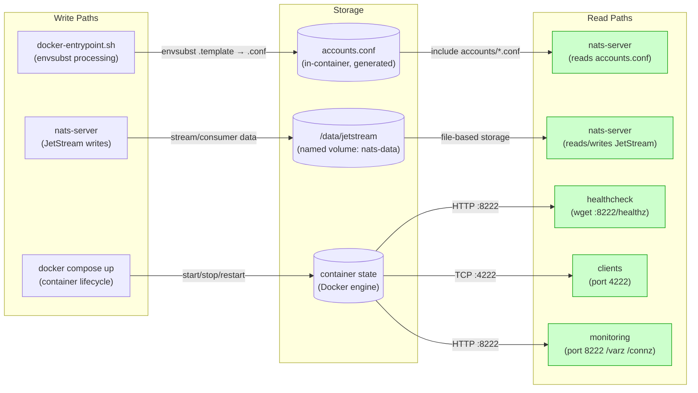
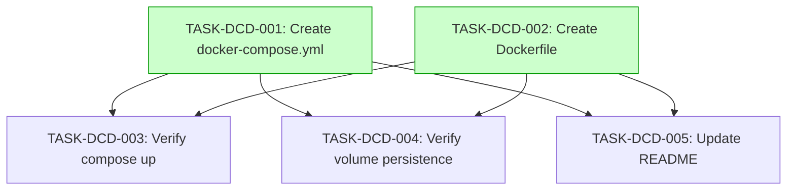

# Implementation Guide: Docker Compose Deployment

**Feature**: NATS server with JetStream, volume persistence, health checks
**Feature ID**: FEAT-DCD
**Parent Review**: TASK-REV-1A6B
**Approach**: Single docker-compose.yml with Custom Entrypoint (Option 1)
**Overall Complexity**: 4/10
**Tasks**: 5

---

## Data Flow: Read/Write Paths

This is the primary review artefact. It shows how configuration flows from host files through Docker into the running NATS server, and how JetStream data persists via the named volume.

_All write paths have corresponding read paths. No disconnections detected._

---

## Task Dependencies

_Tasks with green background can run in parallel._

---

## Execution Strategy

### Wave 1: Foundation (2 tasks, parallel)

Both scaffolding tasks can run in parallel — they produce separate files (`docker-compose.yml` and `Dockerfile`) with a known coordination point (compose references the Dockerfile via `build: .`).

| Task | Name | Mode | Complexity |
|------|------|------|-----------|
| TASK-DCD-001 | Create docker-compose.yml | task-work | 3/10 |
| TASK-DCD-002 | Create Dockerfile | task-work | 3/10 |

**Coordination**: TASK-DCD-001 should use `build: .` in the service definition, anticipating the Dockerfile from TASK-DCD-002. If implementing sequentially, TASK-DCD-001 first.

### Wave 2: Verification + Documentation (3 tasks, parallel)

All three depend on Wave 1 completion. Testing tasks require a running Docker environment on the GB10 or local machine. Documentation can run in parallel with testing.

| Task | Name | Mode | Complexity |
|------|------|------|-----------|
| TASK-DCD-003 | Verify compose up | direct | 2/10 |
| TASK-DCD-004 | Verify volume persistence | direct | 2/10 |
| TASK-DCD-005 | Update README | direct | 1/10 |

---

## Key Design Decisions

| Decision | Choice | Rationale |
|----------|--------|-----------|
| Image | `nats:2.11-alpine` | Pinned major avoids breaking changes; Alpine for small footprint |
| Volume | Named volume `nats-data` | Docker-managed, survives `docker compose down`, easy backup |
| Health check | `wget --spider :8222/healthz` | Built into Alpine, fast, reliable |
| Start period | 5 seconds | JetStream file store needs init time |
| Restart | `unless-stopped` | Survives reboot, respects manual `docker stop` |
| Network | Custom `ships-computer` | Fleet compose files join this network (Feature 7) |
| Passwords | envsubst in entrypoint | Already implemented; validates all 4 vars before start |
| Config mounts | Read-only (`:ro`) | Prevents accidental container-side config writes |
| Dockerfile | Custom with `gettext` | Guarantees `envsubst` availability regardless of base image changes |

---

## File Mapping

| File | Created By | Purpose |
|------|-----------|---------|
| `docker-compose.yml` | TASK-DCD-001 | NATS service definition, volumes, networks |
| `Dockerfile` | TASK-DCD-002 | Custom image with envsubst support |
| `.dockerignore` | TASK-DCD-002 | Exclude non-build files from Docker context |
| `README.md` | TASK-DCD-005 | Updated deployment instructions |

---

## Risk Mitigations

| Risk | Mitigation |
|------|-----------|
| `wget` removed from future NATS Alpine | Dockerfile controls the image; can add `wget` explicitly |
| JetStream data loss on `down -v` | TASK-DCD-005 documents the warning prominently in README |
| Port conflicts on GB10 | 4222/8222 are NATS-standard; documented in system spec |
| envsubst breaks on special chars in passwords | entrypoint.sh already uses `set -eu` for error handling |

---

## Prerequisites

- Docker and Docker Compose v2 installed on target machine
- `.env` file with 4 required password variables (copy from `.env.example`)
- Ports 4222 and 8222 available
- `nats` CLI tool for verification tasks (TASK-DCD-003, TASK-DCD-004)
