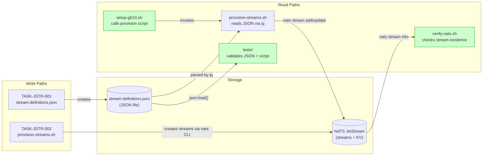
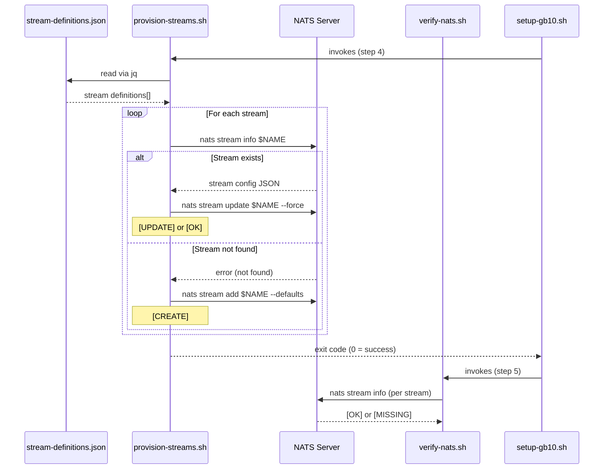
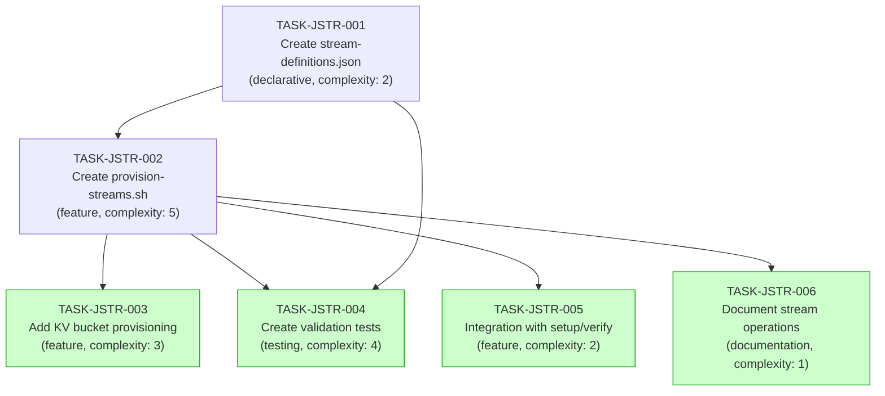

# Implementation Guide: JetStream Stream Definitions

**Feature**: FEAT-JSTR | **Review**: TASK-REV-E14C | **Complexity**: 6/10

## Approach

**JSON + Shell with Check-Create-Update idempotency.** A declarative `stream-definitions.json` is the single source of truth. An idempotent `provision-streams.sh` reads it via `jq` and applies check-then-create-or-update for each stream.

## Decision Summary

| Decision | Choice | Rationale |
|----------|--------|-----------|
| Definition format | JSON file | Spec-aligned, diffable, machine-readable |
| Provisioning tool | Shell + `jq` + `nats` CLI | Simple, spec-aligned, `jq` already in use |
| Idempotency | Check-then-create-or-update | Full idempotency with change propagation |
| Project streams | Same JSON, `scope` field | Single source of truth |

## Data Flow: Read/Write Paths

_All write paths have corresponding read paths. No disconnections._

## Integration Contracts

_Shows the full provisioning flow from setup through verification._

## Task Dependencies

_Tasks with green background (Wave 3) can run in parallel after Wave 2 completes._

## Execution Strategy

### Wave 1 (Foundation)
| Task | Mode | Complexity | Description |
|------|------|-----------|-------------|
| TASK-JSTR-001 | direct | 2 | Create `stream-definitions.json` |

### Wave 2 (Core Script)
| Task | Mode | Complexity | Description |
|------|------|-----------|-------------|
| TASK-JSTR-002 | task-work | 5 | Create `provision-streams.sh` with idempotency |

### Wave 3 (Parallel -- 4 tasks)
| Task | Mode | Complexity | Description |
|------|------|-----------|-------------|
| TASK-JSTR-003 | direct | 3 | Add KV bucket provisioning |
| TASK-JSTR-004 | task-work | 4 | Create validation tests |
| TASK-JSTR-005 | direct | 2 | Integration with setup/verify scripts |
| TASK-JSTR-006 | direct | 1 | Document stream operations |

## Section 4: Integration Contracts

### Contract: stream-definitions.json
- **Producer task:** TASK-JSTR-001
- **Consumer task(s):** TASK-JSTR-002, TASK-JSTR-003, TASK-JSTR-004
- **Artifact type:** JSON data file
- **Format constraint:** Top-level object with `.streams[]` array. Each entry has: `name` (string), `subjects` (string array), `retention` ("work" | "limits"), `max_age` (NATS duration string), `max_msgs` (integer), `storage` ("file"), `replicas` (integer). Optional: `scope`, `description`, `account`.
- **Validation method:** `jq '.streams | length' streams/stream-definitions.json` returns >= 7; `python -m json.tool streams/stream-definitions.json` succeeds.

### Contract: provision-streams.sh exit code
- **Producer task:** TASK-JSTR-002
- **Consumer task(s):** TASK-JSTR-005 (setup-gb10.sh integration)
- **Artifact type:** Process exit code
- **Format constraint:** Exit 0 on success (all streams provisioned). Non-zero only on fatal errors (NATS unreachable, jq missing). Individual stream update failures are logged but do not cause non-zero exit.
- **Validation method:** Run script twice; both runs exit 0.

## Risk Register

| Risk | Likelihood | Mitigation |
|------|-----------|------------|
| `jq` not on GB10 | Low | Include in `setup-gb10.sh` apt install |
| Stream update fails on subject change | Low | Log error, continue, document limitation |
| Race: script runs before NATS ready | Medium | Health check wait loop at script start |
| FINPROXY stream not accessible from FINPROXY account | Medium | Support optional `account` field in JSON for per-account provisioning |
