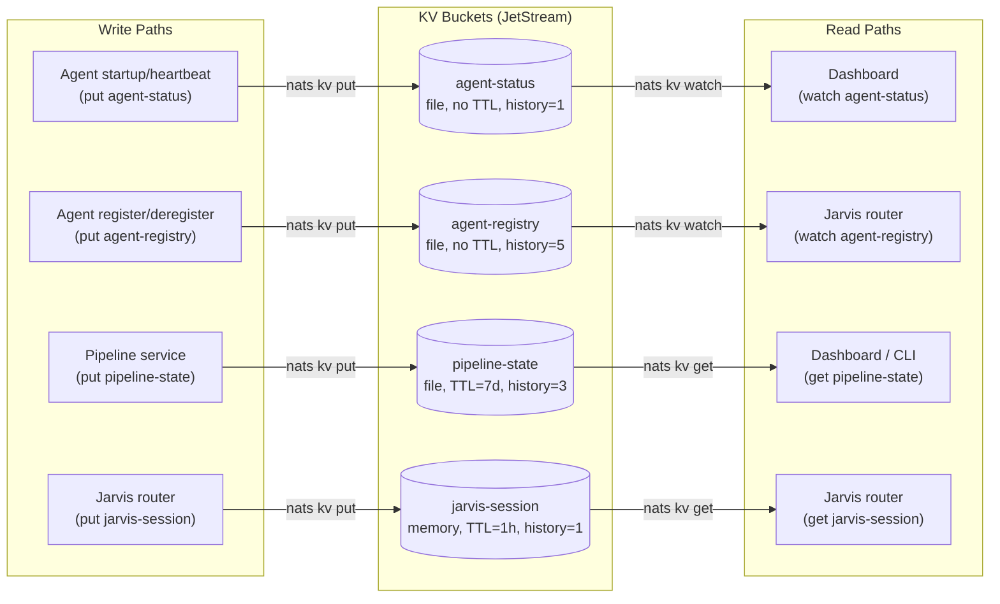
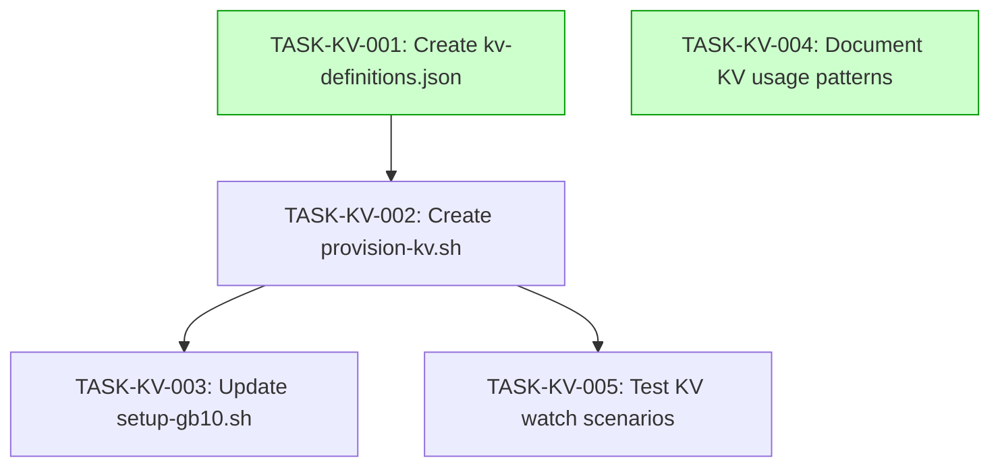
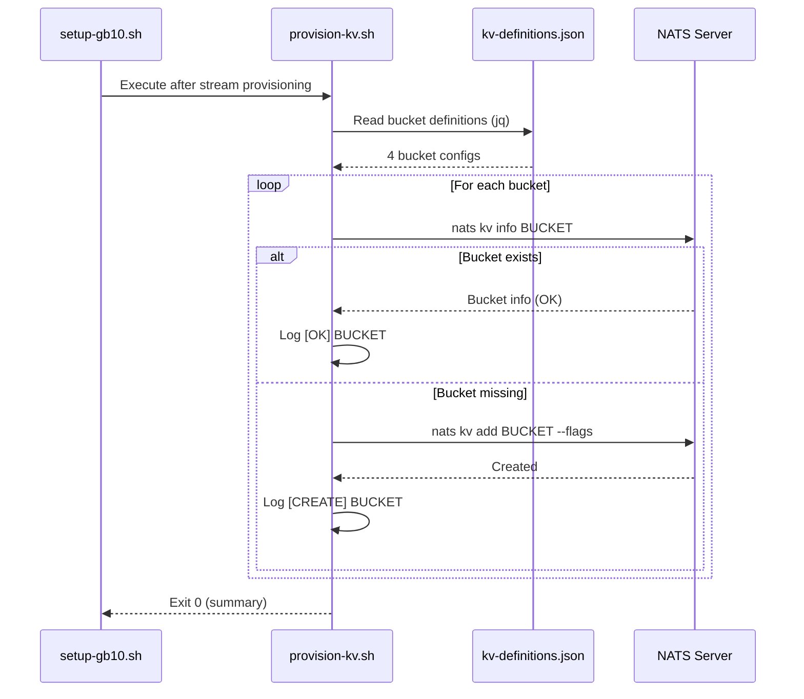

# Implementation Guide: KV Stores

**Feature**: KV Stores — agent-status, agent-registry, pipeline-state, jarvis-session buckets
**Review**: TASK-REV-4721
**Approach**: Option 1 — Separate `kv/` directory with definitions JSON + provisioning script

---

## Data Flow: Read/Write Paths

_All write paths have corresponding read paths. No disconnections._

---

## Task Dependencies

_Tasks with green background can run in parallel (Wave 1: TASK-KV-001 + TASK-KV-004)._

---

## Integration Contract: Provisioning Script reads Definitions

---

## Section 4: Integration Contracts

### Contract: KV_DEFINITIONS_FILE
- **Producer task:** TASK-KV-001 (Create kv-definitions.json)
- **Consumer task(s):** TASK-KV-002 (Create provision-kv.sh)
- **Artifact type:** JSON file at `kv/kv-definitions.json`
- **Format constraint:** JSON object with `"kv_buckets"` array, each entry having: `name` (string), `ttl` (string, nats duration or empty), `storage` (string: "file"|"memory"), `history` (int), `max_value_size` (string, e.g. "64K"), `replicas` (int), `description` (string)
- **Validation method:** `jq '.kv_buckets | length' kv/kv-definitions.json` returns `4`

### Contract: PROVISION_KV_SCRIPT
- **Producer task:** TASK-KV-002 (Create provision-kv.sh)
- **Consumer task(s):** TASK-KV-003 (Update setup-gb10.sh)
- **Artifact type:** Executable shell script at `kv/provision-kv.sh`
- **Format constraint:** Script must accept `--dry-run` flag, use `NATS_URL` and `NATS_CREDS` env vars, exit 0 on success
- **Validation method:** `kv/provision-kv.sh --dry-run` exits 0 and outputs expected bucket names

---

## Execution Strategy

### Wave 1: Definitions + Documentation (parallel)

| Task | Mode | Description |
|------|------|-------------|
| TASK-KV-001 | direct | Create `kv/kv-definitions.json` |
| TASK-KV-004 | direct | Document KV usage patterns in README |

### Wave 2: Provisioning Script + Setup (sequential)

| Task | Mode | Description |
|------|------|-------------|
| TASK-KV-002 | task-work | Create `kv/provision-kv.sh` (depends on TASK-KV-001) |
| TASK-KV-003 | direct | Update `scripts/setup-gb10.sh` (depends on TASK-KV-002) |

### Wave 3: Testing

| Task | Mode | Description |
|------|------|-------------|
| TASK-KV-005 | direct | Test KV watch scenarios (depends on TASK-KV-002) |

---

## KV Bucket Configuration Reference

| Bucket | Keys Pattern | TTL | Storage | History | Max Value | Purpose |
|--------|-------------|-----|---------|---------|-----------|---------|
| `agent-status` | `{agent_id}` | None | file | 1 | 64KB | Agent online/offline/busy status |
| `agent-registry` | `{agent_id}` | None | file | 5 | 256KB | Capability manifests for routing |
| `pipeline-state` | `{feature_id}` | 7d | file | 3 | 64KB | Pipeline state machine |
| `jarvis-session` | `{session_id}` | 1h | memory | 1 | 128KB | Conversation context |

### Design Rationale

- **agent-registry history=5**: Allows rollback if a broken capability manifest is pushed. Jarvis can fall back to a previous version.
- **pipeline-state history=3**: Enables viewing recent state transitions (e.g., `planning` -> `implementing` -> `testing`).
- **jarvis-session memory storage**: Ephemeral data with high write frequency. Memory avoids disk I/O. 1hr TTL auto-cleans abandoned sessions.
- **agent-status history=1**: Only the latest status matters. No need to track status history.

### Account Scoping

All 4 KV buckets belong to the **APPMILLA** account (fleet-wide infrastructure). The FINPROXY account does not need access to these buckets. No additional account configuration is required per ADR-002.
