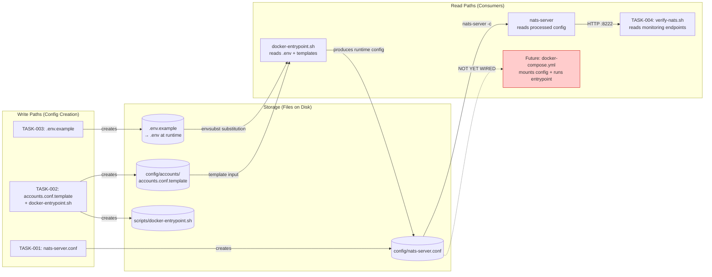
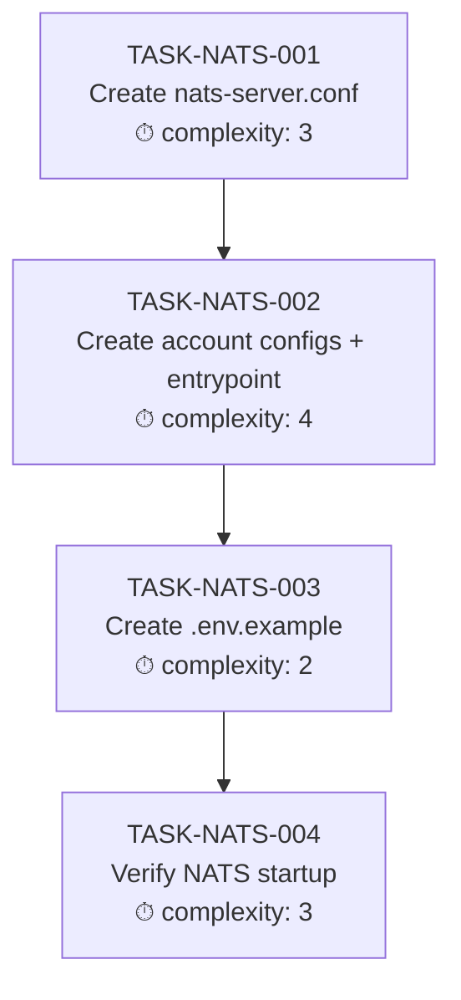

# Implementation Guide: NATS Server Configuration

## Overview

Create `nats-server.conf` with JetStream enabled for deployment on Dell DGX Spark GB10 (128GB). Includes account-based multi-tenancy (ADR-002), envsubst credential management, and verification testing.

**Parent Review**: TASK-REV-69BD
**Feature ID**: FEAT-NATS-CFG
**Approach**: Option 1 — Single nats-server.conf + include accounts + envsubst for credentials
**Execution**: Sequential (4 waves)
**Testing**: Standard (startup, JetStream init, monitoring, basic auth)

---

## Data Flow: Read/Write Paths



**Disconnection Alert**: `docker-compose.yml` is not part of this feature (it's Feature 4 in the system spec). The config files created here will be consumed by docker-compose.yml in a future feature. This is intentional — the config must exist before the compose file references it.

---

## Task Dependencies



_All tasks are sequential — each depends on the previous._

---

## §4: Integration Contracts

### Contract: NATS_CONFIG_PATH
- **Producer task:** TASK-NATS-001
- **Consumer task(s):** TASK-NATS-002 (include directive), Future docker-compose.yml (volume mount)
- **Artifact type:** file path
- **Format constraint:** Config file at `config/nats-server.conf` with `include "accounts/*.conf"` directive. The include path is relative to the container mount point `/etc/nats/`.
- **Validation method:** Verify `include "accounts/*.conf"` line exists in nats-server.conf; verify accounts directory exists at same level.

### Contract: ACCOUNT_TEMPLATE_VARS
- **Producer task:** TASK-NATS-002 (defines template variables)
- **Consumer task(s):** TASK-NATS-003 (documents them in .env.example)
- **Artifact type:** environment variable names
- **Format constraint:** Variables named `RICH_NATS_PASSWORD`, `JAMES_NATS_PASSWORD`, `MARK_NATS_PASSWORD`, `ADMIN_NATS_PASSWORD` — must match `${VAR}` references in accounts.conf.template exactly.
- **Validation method:** Extract `${...}` references from template, compare against .env.example entries. All template vars must appear in .env.example.

### Contract: MONITORING_ENDPOINT
- **Producer task:** TASK-NATS-001 (configures http_port 8222)
- **Consumer task(s):** TASK-NATS-004 (verification script checks endpoints)
- **Artifact type:** HTTP endpoint
- **Format constraint:** `http://localhost:8222/healthz`, `http://localhost:8222/varz`, `http://localhost:8222/jsz` — standard NATS monitoring API.
- **Validation method:** verify-nats.sh checks HTTP 200 response from each endpoint.

---

## Execution Plan

### Wave 1: TASK-NATS-001 — Create nats-server.conf
- **Mode**: task-work
- **Creates**: `config/nats-server.conf`
- **Key decisions**: JetStream limits (1GB mem, 10GB file), binding 0.0.0.0 for Tailscale

### Wave 2: TASK-NATS-002 — Create account configs + entrypoint
- **Mode**: task-work
- **Creates**: `config/accounts/accounts.conf.template`, `scripts/docker-entrypoint.sh`
- **Key decisions**: envsubst template approach, 3 accounts (APPMILLA, FINPROXY, SYS)
- **Depends on**: TASK-NATS-001 (nats-server.conf must have include directive)

### Wave 3: TASK-NATS-003 — Create .env.example
- **Mode**: direct
- **Creates**: `.env.example`
- **Key decisions**: Document all template variables with placeholder values
- **Depends on**: TASK-NATS-002 (must know which env vars the template uses)

### Wave 4: TASK-NATS-004 — Verify NATS startup
- **Mode**: task-work
- **Creates**: `scripts/verify-nats.sh`
- **Key decisions**: curl-based HTTP checks (no nats CLI dependency for basic verification)
- **Depends on**: All previous tasks

---

## Architecture Notes

### File Layout After Implementation

```
config/
├── nats-server.conf              # Main server config (JetStream, ports, logging)
└── accounts/
    └── accounts.conf.template    # envsubst template with ${PASSWORD} placeholders

scripts/
├── docker-entrypoint.sh          # Runs envsubst then exec nats-server
└── verify-nats.sh                # Startup verification script

.env.example                      # Documents all required environment variables
.env                              # Runtime secrets (gitignored, not committed)
```

### envsubst Flow

```
.env (secrets)  +  accounts.conf.template  →  envsubst  →  /etc/nats/accounts/accounts.conf  →  nats-server
```

### Security Model

- **Network layer**: Tailscale mesh VPN controls who can reach port 4222/8222
- **Application layer**: NATS accounts scope permissions per project
- **Credential layer**: Passwords in `.env` (gitignored), templates in repo
- **Recommendation**: Add `ufw` rules on GB10 to block 4222/8222 on non-Tailscale interfaces

### JetStream Sizing for GB10

| Setting | Value | GB10 Context |
|---------|-------|-------------|
| max_mem | 1GB | 0.8% of 128GB RAM — leaves headroom for CUDA workloads |
| max_file | 10GB | Covers 7 streams with 7-day retention |
| store_dir | /data/jetstream | Docker named volume for persistence |

These limits can be increased later without downtime (NATS supports config reload via `nats-server --signal reload`).
