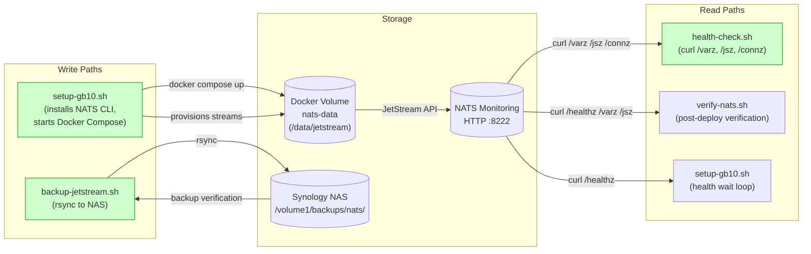
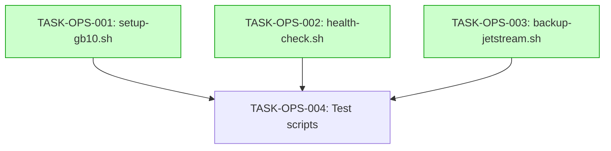

# Implementation Guide: Operations Scripts

**Feature**: Operations Scripts (setup-gb10.sh, health-check.sh, backup-jetstream.sh)
**Parent Review**: TASK-REV-2462
**Feature ID**: FEAT-OPS
**Total Tasks**: 4
**Estimated Duration**: 3-4 hours

---

## Data Flow: Read/Write Paths



_All write paths have corresponding read paths. No disconnections detected._

---

## Task Dependencies



_Tasks with green background can run in parallel._

---

## Execution Strategy

### Wave 1: Script Creation (3 tasks, parallel-safe)

All three scripts operate on independent files with no shared state. They can be implemented in parallel.

| Task | Script | Complexity | Mode | File |
|------|--------|------------|------|------|
| TASK-OPS-001 | setup-gb10.sh | 4/10 | task-work | `scripts/setup-gb10.sh` |
| TASK-OPS-002 | health-check.sh | 2/10 | direct | `scripts/health-check.sh` |
| TASK-OPS-003 | backup-jetstream.sh | 3/10 | direct | `scripts/backup-jetstream.sh` |

### Wave 2: Testing (1 task, sequential after Wave 1)

| Task | Description | Complexity | Mode | Depends On |
|------|-------------|------------|------|------------|
| TASK-OPS-004 | Test all scripts | 3/10 | direct | OPS-001, OPS-002, OPS-003 |

---

## Approach Details

### setup-gb10.sh (TASK-OPS-001)

**Pattern**: Monolithic idempotent script

```
1. Check dependencies (docker, docker compose, curl)
2. Install NATS CLI if not present
3. Check if ships-computer-nats container exists/running
4. docker compose up -d (if not already running)
5. Wait for health endpoint (configurable timeout)
6. Run streams/provision-streams.sh (if exists)
7. Run scripts/verify-nats.sh for final verification
```

**Key patterns from existing codebase**:
- Use `set -euo pipefail` (matches `docker-entrypoint.sh`)
- Use `has_command()` pattern from `verify-nats.sh`
- Use health wait loop pattern from `verify-nats.sh`

### health-check.sh (TASK-OPS-002)

**Pattern**: Lightweight monitoring probe

```
1. Query /varz → server_name, version, uptime
2. Query /jsz → memory usage, storage usage, stream count
3. Query /connz → connected client count
4. Report summary with exit code
```

**Key patterns from existing codebase**:
- Use `json_field()` / `json_num_field()` helpers from `verify-nats.sh`
- Use `NATS_MONITOR_URL` env var pattern from `verify-nats.sh`
- Differentiate from `verify-nats.sh`: operational status vs configuration verification

### backup-jetstream.sh (TASK-OPS-003)

**Pattern**: rsync with timestamped directories and retention

```
1. Pre-flight: check NAS reachability via SSH
2. Create timestamped backup directory on NAS
3. rsync -avz JetStream data to NAS
4. Post-backup: verify directory exists and report size
5. Retention: remove backups older than N days
```

**Configuration via environment variables**:
- `BACKUP_NAS_HOST` (default: `nas.tail`)
- `BACKUP_NAS_PATH` (default: `/volume1/backups/nats`)
- `JETSTREAM_DATA_DIR` (default: `/data/jetstream`)
- `BACKUP_RETAIN_DAYS` (default: `7`)

---

## Common Script Patterns

All scripts should follow these conventions established by existing scripts:

| Convention | Pattern | Source |
|------------|---------|--------|
| Shebang | `#!/bin/bash` | Ubuntu 24.04 target |
| Error handling | `set -euo pipefail` | `docker-entrypoint.sh` |
| Config | Environment variables with defaults | `verify-nats.sh` |
| JSON parsing | `jq` with `grep` fallback | `verify-nats.sh` |
| Output style | Sectioned with `===` / `---` headers | `verify-nats.sh` |
| Exit codes | Meaningful (0=ok, 1=fail, 2=unreachable) | Convention |

---

## Next Steps

1. Review this guide and the task files in `tasks/backlog/operations-scripts/`
2. Start Wave 1 (all three scripts can be built in parallel)
3. After Wave 1 completes, run Wave 2 (testing)
4. Start implementation: `/task-work TASK-OPS-001`
